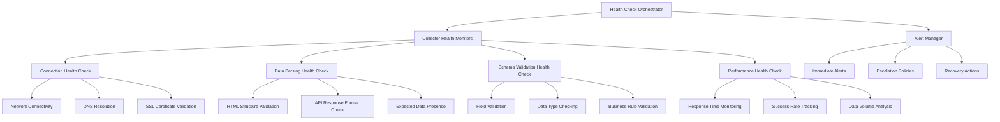

# Data Collector Health Monitoring & Maintenance System Design

| Metadata            | Value                                       |
|---------------------|---------------------------------------------|
| **Document Type** | System Design Specification |
| **Component** | Data Collection Infrastructure |
| **Version** | v1.0-comprehensive-health-monitoring |
| **Created** | 2025-07-15 |
| **Status** | Design Phase |

---

## 1. Problem Statement

Web scraping and API-based data collection is inherently brittle due to:
- **HTML Structure Changes**: Websites frequently update layouts, breaking CSS selectors and parsing logic
- **API Changes**: Rate limits, authentication changes, endpoint modifications
- **Network Issues**: Timeouts, DNS failures, intermittent connectivity
- **Content Changes**: Data format modifications, missing fields, schema evolution
- **Anti-Bot Measures**: CAPTCHAs, IP blocking, user-agent filtering

**Current Pain Points**:
- Silent failures that go undetected for hours/days
- No systematic approach to collector health monitoring
- Manual detection of collection issues
- Inconsistent error handling across collectors
- Lack of proactive alerting when data sources change

---

## 2. Design Objectives

### Primary Goals
- **Proactive Failure Detection**: Identify collector failures within minutes, not hours
- **Automated Health Monitoring**: Continuous validation of collector functionality
- **Intelligent Alerting**: Context-aware notifications with actionable information
- **Self-Healing Capabilities**: Automatic recovery from transient failures
- **Maintenance Automation**: Reduce manual intervention for common issues

### Secondary Goals
- **Performance Monitoring**: Track collection speed, success rates, data quality
- **Trend Analysis**: Identify degrading performance before total failure
- **Operational Insights**: Understand collector behavior patterns
- **Compliance Tracking**: Monitor rate limiting and respectful scraping

---

## 3. System Architecture

### 3.1 Health Check Framework



### 3.2 Component Architecture

```python
class CollectorHealthMonitor:
    """
    Comprehensive health monitoring for individual collectors.
    Implements multiple health check types with configurable thresholds.
    """
    
    def __init__(self, collector: BaseCollector, config: HealthConfig):
        self.collector = collector
        self.config = config
        self.health_status = HealthStatus.UNKNOWN
        self.last_check = None
        self.failure_count = 0
        self.performance_metrics = PerformanceMetrics()
    
    async def run_health_checks(self) -> HealthCheckResult:
        """Execute all configured health checks."""
        pass
    
    async def check_connectivity(self) -> ConnectivityResult:
        """Verify network connectivity to data source."""
        pass
    
    async def check_data_parsing(self) -> ParsingResult:
        """Validate data parsing and extraction logic."""
        pass
    
    async def check_schema_compliance(self) -> SchemaResult:
        """Ensure collected data matches expected schema."""
        pass
    
    async def check_performance(self) -> PerformanceResult:
        """Monitor performance metrics and trends."""
        pass
```

---

## 4. Health Check Types

### 4.1 Connectivity Health Checks

**Purpose**: Verify network-level connectivity to data sources

**Checks Performed**:
- DNS resolution for target domains
- TCP connection establishment
- SSL certificate validation
- HTTP status code verification
- Response time measurement

**Implementation**:
```python
async def check_connectivity(self) -> ConnectivityResult:
    """
    Verify network connectivity to data source.
    
    Returns:
        ConnectivityResult with status, response_time, and error details
    """
    start_time = time.time()
    
    try:
        # DNS resolution check
        dns_result = await self._check_dns_resolution()
        if not dns_result.success:
            return ConnectivityResult(
                status=HealthStatus.CRITICAL,
                error=f"DNS resolution failed: {dns_result.error}"
            )
        
        # HTTP connectivity check
        async with aiohttp.ClientSession() as session:
            async with session.get(
                self.collector.base_url,
                timeout=aiohttp.ClientTimeout(total=10)
            ) as response:
                response_time = time.time() - start_time
                
                if response.status >= 400:
                    return ConnectivityResult(
                        status=HealthStatus.CRITICAL,
                        response_time=response_time,
                        error=f"HTTP {response.status}: {response.reason}"
                    )
                
                return ConnectivityResult(
                    status=HealthStatus.HEALTHY,
                    response_time=response_time
                )
                
    except asyncio.TimeoutError:
        return ConnectivityResult(
            status=HealthStatus.CRITICAL,
            error="Connection timeout"
        )
    except Exception as e:
        return ConnectivityResult(
            status=HealthStatus.CRITICAL,
            error=f"Connection failed: {str(e)}"
        )
```

### 4.2 Data Parsing Health Checks

**Purpose**: Validate that data extraction logic still works correctly

**Checks Performed**:
- HTML structure validation for scraped sources
- API response format verification
- Expected data field presence
- Data extraction accuracy

**Implementation**:
```python
async def check_data_parsing(self) -> ParsingResult:
    """
    Validate data parsing and extraction logic.
    
    Tests parsing logic against live data without storing results.
    """
    try:
        # Perform test collection with minimal data
        test_request = CollectionRequest(
            source=self.collector.source,
            test_mode=True,
            max_records=5
        )
        
        result = await self.collector.collect(test_request)
        
        if result.status == CollectionStatus.FAILED:
            return ParsingResult(
                status=HealthStatus.CRITICAL,
                error=f"Collection failed: {result.error_message}"
            )
        
        # Validate extracted data structure
        validation_result = self._validate_extracted_data(result.data)
        
        return ParsingResult(
            status=validation_result.status,
            records_parsed=len(result.data),
            validation_errors=validation_result.errors
        )
        
    except Exception as e:
        return ParsingResult(
            status=HealthStatus.CRITICAL,
            error=f"Parsing check failed: {str(e)}"
        )

def _validate_extracted_data(self, data: list) -> ValidationResult:
    """Validate that extracted data meets expectations."""
    errors = []
    
    if not data:
        errors.append("No data extracted")
        return ValidationResult(HealthStatus.CRITICAL, errors)
    
    # Check required fields are present
    for record in data[:3]:  # Sample first 3 records
        missing_fields = []
        for field in self.config.required_fields:
            if field not in record or record[field] is None:
                missing_fields.append(field)
        
        if missing_fields:
            errors.append(f"Missing required fields: {missing_fields}")
    
    # Determine status based on error count
    if errors:
        status = HealthStatus.DEGRADED if len(errors) < 3 else HealthStatus.CRITICAL
    else:
        status = HealthStatus.HEALTHY
    
    return ValidationResult(status, errors)
```

### 4.3 Schema Validation Health Checks

**Purpose**: Ensure collected data conforms to expected schema and business rules

**Checks Performed**:
- Data type validation
- Field format validation (dates, numbers, enums)
- Business rule validation (reasonable ranges, relationships)
- Data completeness assessment

**Implementation**:
```python
async def check_schema_compliance(self) -> SchemaResult:
    """
    Ensure collected data matches expected schema.
    
    Validates data types, formats, and business rules.
    """
    try:
        # Get recent data sample
        recent_data = await self._get_recent_sample()
        
        validation_errors = []
        for record in recent_data:
            errors = self._validate_record_schema(record)
            validation_errors.extend(errors)
        
        # Calculate compliance percentage
        total_checks = len(recent_data) * len(self.config.schema_rules)
        compliance_pct = max(0, 1 - (len(validation_errors) / total_checks))
        
        if compliance_pct < 0.5:
            status = HealthStatus.CRITICAL
        elif compliance_pct < 0.8:
            status = HealthStatus.DEGRADED
        else:
            status = HealthStatus.HEALTHY
        
        return SchemaResult(
            status=status,
            compliance_percentage=compliance_pct,
            validation_errors=validation_errors[:10]  # Limit error details
        )
        
    except Exception as e:
        return SchemaResult(
            status=HealthStatus.CRITICAL,
            error=f"Schema validation failed: {str(e)}"
        )

def _validate_record_schema(self, record: dict) -> list[str]:
    """Validate individual record against schema rules."""
    errors = []
    
    for field, rules in self.config.schema_rules.items():
        if field not in record:
            if rules.get('required', False):
                errors.append(f"Missing required field: {field}")
            continue
        
        value = record[field]
        
        # Type validation
        expected_type = rules.get('type')
        if expected_type and not isinstance(value, expected_type):
            errors.append(f"Invalid type for {field}: expected {expected_type}, got {type(value)}")
        
        # Format validation
        format_rule = rules.get('format')
        if format_rule and not self._validate_format(value, format_rule):
            errors.append(f"Invalid format for {field}: {value}")
        
        # Range validation
        min_val, max_val = rules.get('min'), rules.get('max')
        if min_val is not None and value < min_val:
            errors.append(f"{field} below minimum: {value} < {min_val}")
        if max_val is not None and value > max_val:
            errors.append(f"{field} above maximum: {value} > {max_val}")
    
    return errors
```

### 4.4 Performance Health Checks

**Purpose**: Monitor collector performance metrics and detect degradation

**Checks Performed**:
- Response time monitoring
- Success rate tracking
- Data volume analysis
- Rate limiting compliance
- Resource utilization

**Implementation**:
```python
async def check_performance(self) -> PerformanceResult:
    """
    Monitor performance metrics and trends.
    
    Analyzes recent performance data to detect degradation.
    """
    try:
        # Get performance metrics for last 24 hours
        metrics = await self._get_performance_metrics(hours=24)
        
        # Calculate key performance indicators
        avg_response_time = metrics.avg_response_time
        success_rate = metrics.success_rate
        records_per_hour = metrics.records_per_hour
        
        # Evaluate against thresholds
        issues = []
        status = HealthStatus.HEALTHY
        
        if avg_response_time > self.config.max_response_time:
            issues.append(f"Slow response time: {avg_response_time:.2f}s")
            status = max(status, HealthStatus.DEGRADED)
        
        if success_rate < self.config.min_success_rate:
            issues.append(f"Low success rate: {success_rate:.1%}")
            status = max(status, HealthStatus.CRITICAL)
        
        if records_per_hour < self.config.min_records_per_hour:
            issues.append(f"Low data volume: {records_per_hour} records/hour")
            status = max(status, HealthStatus.DEGRADED)
        
        return PerformanceResult(
            status=status,
            avg_response_time=avg_response_time,
            success_rate=success_rate,
            records_per_hour=records_per_hour,
            issues=issues
        )
        
    except Exception as e:
        return PerformanceResult(
            status=HealthStatus.CRITICAL,
            error=f"Performance check failed: {str(e)}"
        )
```

---

## 5. Alerting and Notification System

### 5.1 Alert Manager Architecture

```python
class AlertManager:
    """
    Manages alerting policies and notification delivery.
    Implements escalation policies and alert correlation.
    """
    
    def __init__(self, config: AlertConfig):
        self.config = config
        self.alert_channels = self._initialize_channels()
        self.escalation_policies = self._load_escalation_policies()
        self.alert_history = AlertHistory()
    
    async def process_health_result(self, collector: str, result: HealthCheckResult):
        """Process health check results and trigger alerts if needed."""
        
        # Determine if alert should be triggered
        should_alert = self._should_trigger_alert(collector, result)
        
        if should_alert:
            alert = Alert(
                collector=collector,
                severity=self._determine_severity(result),
                message=self._generate_alert_message(result),
                timestamp=datetime.now(),
                correlation_id=self._get_correlation_id(collector, result)
            )
            
            await self._send_alert(alert)
            self.alert_history.record(alert)
    
    def _should_trigger_alert(self, collector: str, result: HealthCheckResult) -> bool:
        """Determine if an alert should be triggered based on policies."""
        
        # Check if this is a new failure
        if result.overall_status == HealthStatus.CRITICAL:
            return True
        
        # Check if degradation has persisted
        if result.overall_status == HealthStatus.DEGRADED:
            recent_failures = self.alert_history.get_recent_failures(
                collector, hours=1
            )
            return len(recent_failures) >= self.config.degradation_threshold
        
        return False
    
    async def _send_alert(self, alert: Alert):
        """Send alert through configured channels."""
        
        # Determine appropriate channels based on severity
        channels = self._select_channels(alert.severity)
        
        # Send to each channel
        for channel in channels:
            try:
                await channel.send(alert)
            except Exception as e:
                logger.error(f"Failed to send alert via {channel.name}: {e}")
```

### 5.2 Alert Channels

**Slack Integration**:
```python
class SlackAlertChannel:
    """Send alerts to Slack channels with rich formatting."""
    
    async def send(self, alert: Alert):
        webhook_url = self.config.slack_webhook_url
        
        message = {
            "text": f"🚨 Data Collector Alert: {alert.collector}",
            "blocks": [
                {
                    "type": "header",
                    "text": {
                        "type": "plain_text",
                        "text": f"🚨 {alert.severity.name} Alert: {alert.collector}"
                    }
                },
                {
                    "type": "section",
                    "fields": [
                        {
                            "type": "mrkdwn",
                            "text": f"*Severity:* {alert.severity.name}"
                        },
                        {
                            "type": "mrkdwn",
                            "text": f"*Time:* {alert.timestamp.strftime('%Y-%m-%d %H:%M:%S')}"
                        },
                        {
                            "type": "mrkdwn",
                            "text": f"*Message:* {alert.message}"
                        }
                    ]
                },
                {
                    "type": "actions",
                    "elements": [
                        {
                            "type": "button",
                            "text": {
                                "type": "plain_text",
                                "text": "View Details"
                            },
                            "url": f"{self.config.dashboard_url}/collectors/{alert.collector}"
                        },
                        {
                            "type": "button",
                            "text": {
                                "type": "plain_text",
                                "text": "Acknowledge"
                            },
                            "action_id": f"ack_{alert.correlation_id}"
                        }
                    ]
                }
            ]
        }
        
        async with aiohttp.ClientSession() as session:
            await session.post(webhook_url, json=message)
```

**Email Integration**:
```python
class EmailAlertChannel:
    """Send detailed email alerts with diagnostic information."""
    
    async def send(self, alert: Alert):
        email_body = self._generate_email_body(alert)
        
        # Send via SMTP or email service
        await self.email_service.send(
            to=self.config.alert_recipients,
            subject=f"Data Collector Alert: {alert.collector} - {alert.severity.name}",
            body=email_body,
            html=True
        )
    
    def _generate_email_body(self, alert: Alert) -> str:
        """Generate detailed HTML email body with diagnostic info."""
        return f"""
        <html>
        <body>
            <h2>Data Collector Health Alert</h2>
            
            <table>
                <tr><td><strong>Collector:</strong></td><td>{alert.collector}</td></tr>
                <tr><td><strong>Severity:</strong></td><td>{alert.severity.name}</td></tr>
                <tr><td><strong>Time:</strong></td><td>{alert.timestamp}</td></tr>
                <tr><td><strong>Message:</strong></td><td>{alert.message}</td></tr>
            </table>
            
            <h3>Diagnostic Information</h3>
            {self._format_diagnostic_info(alert)}
            
            <h3>Recommended Actions</h3>
            {self._format_recommended_actions(alert)}
            
            <p><a href="{self.config.dashboard_url}/collectors/{alert.collector}">
               View Full Diagnostic Dashboard
            </a></p>
        </body>
        </html>
        """
```

### 5.3 Escalation Policies

```python
class EscalationPolicy:
    """Define escalation rules for different alert types."""
    
    def __init__(self, config: EscalationConfig):
        self.rules = [
            EscalationRule(
                condition=lambda alert: alert.severity == AlertSeverity.CRITICAL,
                actions=[
                    NotificationAction(channel="slack", immediate=True),
                    NotificationAction(channel="email", immediate=True),
                    NotificationAction(channel="pagerduty", delay_minutes=5)
                ]
            ),
            EscalationRule(
                condition=lambda alert: alert.severity == AlertSeverity.WARNING,
                actions=[
                    NotificationAction(channel="slack", immediate=True),
                    NotificationAction(channel="email", delay_minutes=15)
                ]
            )
        ]
```

---

## 6. Self-Healing and Recovery

### 6.1 Automatic Recovery Actions

```python
class CollectorRecoveryManager:
    """
    Implements automatic recovery actions for common collector failures.
    """
    
    def __init__(self, config: RecoveryConfig):
        self.config = config
        self.recovery_actions = {
            FailureType.NETWORK_TIMEOUT: self._retry_with_backoff,
            FailureType.RATE_LIMITED: self._apply_rate_limit_backoff,
            FailureType.PARSING_ERROR: self._attempt_graceful_parsing,
            FailureType.AUTHENTICATION: self._refresh_authentication,
            FailureType.SERVER_ERROR: self._circuit_breaker_recovery
        }
    
    async def attempt_recovery(
        self, 
        collector: BaseCollector, 
        failure: CollectionFailure
    ) -> RecoveryResult:
        """Attempt automatic recovery based on failure type."""
        
        recovery_action = self.recovery_actions.get(failure.type)
        if not recovery_action:
            return RecoveryResult(
                success=False,
                message=f"No recovery action for {failure.type}"
            )
        
        try:
            result = await recovery_action(collector, failure)
            
            if result.success:
                logger.info(
                    f"Successfully recovered {collector.source} from {failure.type}",
                    collector=collector.source,
                    failure_type=failure.type,
                    recovery_action=recovery_action.__name__
                )
            
            return result
            
        except Exception as e:
            return RecoveryResult(
                success=False,
                message=f"Recovery action failed: {str(e)}"
            )
    
    async def _retry_with_backoff(
        self, 
        collector: BaseCollector, 
        failure: CollectionFailure
    ) -> RecoveryResult:
        """Implement exponential backoff retry strategy."""
        
        max_retries = self.config.max_retries
        base_delay = self.config.base_retry_delay
        
        for attempt in range(max_retries):
            delay = base_delay * (2 ** attempt)
            await asyncio.sleep(delay)
            
            try:
                # Attempt collection with minimal request
                test_request = CollectionRequest(
                    source=collector.source,
                    test_mode=True,
                    max_records=1
                )
                
                result = await collector.collect(test_request)
                
                if result.status == CollectionStatus.SUCCESS:
                    return RecoveryResult(
                        success=True,
                        message=f"Recovered after {attempt + 1} retries"
                    )
                    
            except Exception as e:
                if attempt == max_retries - 1:
                    return RecoveryResult(
                        success=False,
                        message=f"All retries failed: {str(e)}"
                    )
        
        return RecoveryResult(
            success=False,
            message="Max retries exceeded"
        )
```

### 6.2 Circuit Breaker Pattern

```python
class CollectorCircuitBreaker:
    """
    Implement circuit breaker pattern to prevent cascading failures.
    """
    
    def __init__(self, config: CircuitBreakerConfig):
        self.config = config
        self.state = CircuitState.CLOSED
        self.failure_count = 0
        self.last_failure_time = None
        self.last_success_time = None
    
    async def call(self, collector_func: callable, *args, **kwargs):
        """Execute collector function through circuit breaker."""
        
        if self.state == CircuitState.OPEN:
            if self._should_attempt_reset():
                self.state = CircuitState.HALF_OPEN
            else:
                raise CircuitBreakerOpenError("Circuit breaker is open")
        
        try:
            result = await collector_func(*args, **kwargs)
            self._on_success()
            return result
            
        except Exception as e:
            self._on_failure()
            raise e
    
    def _on_success(self):
        """Handle successful execution."""
        self.failure_count = 0
        self.last_success_time = datetime.now()
        
        if self.state == CircuitState.HALF_OPEN:
            self.state = CircuitState.CLOSED
    
    def _on_failure(self):
        """Handle failed execution."""
        self.failure_count += 1
        self.last_failure_time = datetime.now()
        
        if self.failure_count >= self.config.failure_threshold:
            self.state = CircuitState.OPEN
    
    def _should_attempt_reset(self) -> bool:
        """Determine if circuit breaker should attempt to reset."""
        if not self.last_failure_time:
            return False
        
        time_since_failure = datetime.now() - self.last_failure_time
        return time_since_failure.total_seconds() >= self.config.timeout_seconds
```

---

## 7. Implementation Specifications

### 7.1 Configuration Schema

```python
@dataclass
class HealthMonitoringConfig:
    """Configuration for collector health monitoring."""
    
    # Health check intervals
    connectivity_check_interval: int = 300  # 5 minutes
    parsing_check_interval: int = 900       # 15 minutes
    schema_check_interval: int = 1800       # 30 minutes
    performance_check_interval: int = 600   # 10 minutes
    
    # Performance thresholds
    max_response_time: float = 10.0         # seconds
    min_success_rate: float = 0.95          # 95%
    min_records_per_hour: int = 100
    
    # Alert thresholds
    degradation_threshold: int = 3          # failures before alert
    critical_threshold: int = 1             # immediate alert
    
    # Recovery settings
    max_retries: int = 3
    base_retry_delay: float = 5.0           # seconds
    circuit_breaker_failure_threshold: int = 5
    circuit_breaker_timeout: int = 300      # seconds
    
    # Required fields for validation
    required_fields: list[str] = field(default_factory=lambda: [
        "game_id", "home_team", "away_team", "timestamp"
    ])
    
    # Schema validation rules
    schema_rules: dict = field(default_factory=dict)
```

### 7.2 Database Schema for Health Monitoring

```sql
-- Health check results table
CREATE TABLE monitoring.collector_health_checks (
    id BIGSERIAL PRIMARY KEY,
    collector_name VARCHAR(50) NOT NULL,
    check_type VARCHAR(30) NOT NULL,
    status VARCHAR(20) NOT NULL,
    response_time_ms INTEGER,
    error_message TEXT,
    metadata JSONB,
    checked_at TIMESTAMP WITH TIME ZONE DEFAULT NOW(),
    
    INDEX idx_health_checks_collector_time (collector_name, checked_at),
    INDEX idx_health_checks_status (status, checked_at)
);

-- Performance metrics table
CREATE TABLE monitoring.collector_performance_metrics (
    id BIGSERIAL PRIMARY KEY,
    collector_name VARCHAR(50) NOT NULL,
    metric_type VARCHAR(30) NOT NULL,
    metric_value DECIMAL(10,4) NOT NULL,
    metric_unit VARCHAR(20),
    recorded_at TIMESTAMP WITH TIME ZONE DEFAULT NOW(),
    
    INDEX idx_performance_metrics_collector_time (collector_name, recorded_at),
    INDEX idx_performance_metrics_type (metric_type, recorded_at)
);

-- Alert history table
CREATE TABLE monitoring.alert_history (
    id BIGSERIAL PRIMARY KEY,
    collector_name VARCHAR(50) NOT NULL,
    alert_type VARCHAR(30) NOT NULL,
    severity VARCHAR(20) NOT NULL,
    message TEXT NOT NULL,
    correlation_id UUID,
    acknowledged BOOLEAN DEFAULT FALSE,
    acknowledged_by VARCHAR(100),
    acknowledged_at TIMESTAMP WITH TIME ZONE,
    created_at TIMESTAMP WITH TIME ZONE DEFAULT NOW(),
    
    INDEX idx_alert_history_collector (collector_name, created_at),
    INDEX idx_alert_history_severity (severity, created_at)
);
```

### 7.3 CLI Integration

```python
# Add to src/interfaces/cli/commands/monitoring.py

@monitoring_group.command()
@click.option('--collector', help='Specific collector to check')
@click.option('--detailed', is_flag=True, help='Show detailed health information')
async def health_check(collector: str, detailed: bool):
    """Run health checks on data collectors."""
    
    health_monitor = HealthMonitorOrchestrator()
    
    if collector:
        result = await health_monitor.check_collector(collector)
        display_health_result(result, detailed)
    else:
        results = await health_monitor.check_all_collectors()
        display_health_summary(results, detailed)

@monitoring_group.command()
@click.option('--hours', default=24, help='Hours of history to show')
@click.option('--collector', help='Filter by specific collector')
async def performance_report(hours: int, collector: str):
    """Generate performance report for collectors."""
    
    performance_analyzer = PerformanceAnalyzer()
    report = await performance_analyzer.generate_report(
        hours=hours, 
        collector=collector
    )
    
    display_performance_report(report)

@monitoring_group.command()
@click.option('--severity', type=click.Choice(['INFO', 'WARNING', 'CRITICAL']))
@click.option('--hours', default=24, help='Hours of alert history')
async def alert_history(severity: str, hours: int):
    """Show recent alert history."""
    
    alert_manager = AlertManager()
    alerts = await alert_manager.get_alert_history(
        severity=severity,
        hours=hours
    )
    
    display_alert_history(alerts)
```

---

## 8. Monitoring Dashboard

### 8.1 Real-time Health Dashboard

```python
class HealthDashboard:
    """
    Web-based dashboard for monitoring collector health.
    Provides real-time status and historical trends.
    """
    
    def __init__(self, app):
        self.app = app
        self.health_monitor = HealthMonitorOrchestrator()
        self._setup_routes()
    
    def _setup_routes(self):
        """Setup dashboard routes."""
        
        @self.app.route('/health/overview')
        async def health_overview():
            """Main health dashboard page."""
            collectors_status = await self.health_monitor.get_all_status()
            recent_alerts = await self.health_monitor.get_recent_alerts(hours=24)
            
            return render_template('health_overview.html', {
                'collectors': collectors_status,
                'alerts': recent_alerts,
                'last_updated': datetime.now()
            })
        
        @self.app.route('/health/collector/<collector_name>')
        async def collector_detail(collector_name: str):
            """Detailed view for specific collector."""
            health_history = await self.health_monitor.get_health_history(
                collector_name, hours=48
            )
            performance_metrics = await self.health_monitor.get_performance_metrics(
                collector_name, hours=24
            )
            
            return render_template('collector_detail.html', {
                'collector': collector_name,
                'health_history': health_history,
                'performance': performance_metrics
            })
        
        @self.app.route('/api/health/status')
        async def api_health_status():
            """JSON API for current health status."""
            status = await self.health_monitor.get_all_status()
            return jsonify(status)
```

### 8.2 Performance Analytics

```python
class PerformanceAnalyzer:
    """
    Analyze collector performance trends and identify issues.
    """
    
    async def generate_performance_report(
        self, 
        collector: str = None, 
        hours: int = 24
    ) -> PerformanceReport:
        """Generate comprehensive performance analysis."""
        
        metrics = await self._get_performance_metrics(collector, hours)
        
        # Calculate trends
        response_time_trend = self._calculate_trend(
            metrics, 'response_time'
        )
        success_rate_trend = self._calculate_trend(
            metrics, 'success_rate'
        )
        
        # Identify anomalies
        anomalies = self._detect_anomalies(metrics)
        
        # Generate recommendations
        recommendations = self._generate_recommendations(
            response_time_trend, success_rate_trend, anomalies
        )
        
        return PerformanceReport(
            collector=collector,
            time_range=hours,
            metrics=metrics,
            trends={
                'response_time': response_time_trend,
                'success_rate': success_rate_trend
            },
            anomalies=anomalies,
            recommendations=recommendations
        )
    
    def _detect_anomalies(self, metrics: list) -> list[Anomaly]:
        """Detect performance anomalies using statistical analysis."""
        anomalies = []
        
        # Group metrics by type
        by_type = defaultdict(list)
        for metric in metrics:
            by_type[metric.type].append(metric.value)
        
        # Detect outliers for each metric type
        for metric_type, values in by_type.items():
            outliers = self._statistical_outlier_detection(values)
            
            for outlier_idx in outliers:
                anomalies.append(Anomaly(
                    metric_type=metric_type,
                    value=values[outlier_idx],
                    timestamp=metrics[outlier_idx].timestamp,
                    severity=self._assess_anomaly_severity(
                        metric_type, values[outlier_idx], values
                    )
                ))
        
        return anomalies
```

---

## 9. Implementation Timeline

### Phase 1: Core Health Monitoring (Week 1-2)
- [ ] Implement basic health check framework
- [ ] Add connectivity and parsing health checks
- [ ] Create health check database schema
- [ ] Integrate with existing collectors

### Phase 2: Alerting System (Week 3)
- [ ] Implement alert manager and notification channels
- [ ] Add Slack and email integration
- [ ] Create escalation policies
- [ ] Test alert delivery

### Phase 3: Self-Healing Capabilities (Week 4)
- [ ] Implement recovery manager
- [ ] Add circuit breaker pattern
- [ ] Create automatic retry logic
- [ ] Test recovery scenarios

### Phase 4: Dashboard and Analytics (Week 5-6)
- [ ] Build web-based monitoring dashboard
- [ ] Implement performance analytics
- [ ] Add trend analysis and anomaly detection
- [ ] Create operational reports

### Phase 5: CLI Integration and Testing (Week 7)
- [ ] Add monitoring commands to CLI
- [ ] Create comprehensive test suite
- [ ] Perform end-to-end testing
- [ ] Documentation and training

---

## 10. Success Metrics

### Operational Metrics
- **Mean Time to Detection (MTTD)**: < 5 minutes for critical failures
- **Mean Time to Recovery (MTTR)**: < 30 minutes for common issues
- **False Positive Rate**: < 5% for alerts
- **Collector Uptime**: > 99% for all collectors

### Quality Metrics
- **Data Completeness**: > 95% for all sources
- **Schema Compliance**: > 98% for collected data
- **Performance Consistency**: < 10% variance in response times

### Maintenance Metrics
- **Manual Intervention Rate**: < 1 incident per week
- **Automatic Recovery Success Rate**: > 80%
- **Alert Response Time**: < 15 minutes during business hours

---

This comprehensive design provides a robust foundation for maintaining data collector health and ensuring reliable operation of the MLB betting analysis system. The implementation focuses on proactive monitoring, intelligent alerting, and automated recovery to minimize manual maintenance overhead while maximizing system reliability.