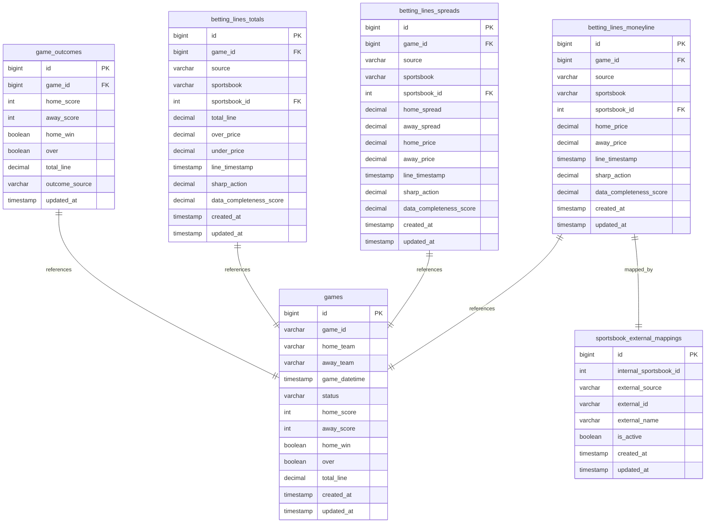
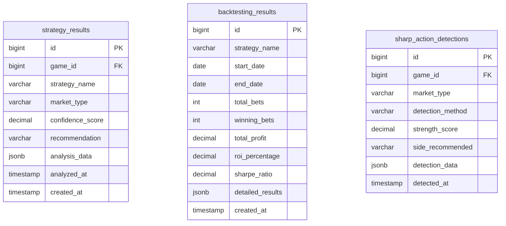
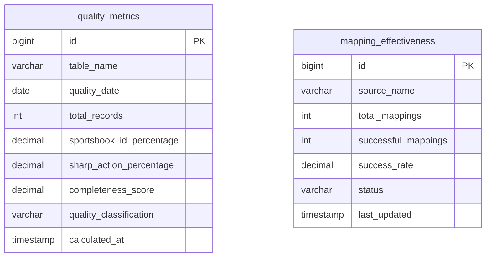

# MLB Sharp Betting Analysis System - Data Model Specification

| Metadata            | Value                                       |
|---------------------|---------------------------------------------|
| **Project** | MLB Sharp Betting Analysis System |
| **Owner** | Sports Betting Intelligence Team |
| **Contributors** | Data Engineering & Analytics Team |
| **Current Version** | `v3.0-unified-architecture` |
| **Last Updated** | 2025-07-15 |

---

## Schema Changelog

| Version                  | Date       | Summary                              | Status    |
|--------------------------|------------|--------------------------------------|-----------|
| `v3.0-unified-architecture` | 2025-07-15 | Unified CLI, data quality system, comprehensive betting analysis | `ACTIVE` |
| `v2.5-data-quality` | 2025-07-10 | Data quality improvements, sportsbook mapping, sharp action integration | `COMPLETED` |
| `v2.0-multi-source` | 2025-06-30 | Multi-source data collection (Action Network, SBD, VSIN) | `COMPLETED` |
| `v1.0-action-network` | 2025-06-15 | Initial Action Network integration | `COMPLETED` |
| `v0.1-setup` | 2025-06-01 | Initial repo structure and basic schema | `COMPLETED` |

---

## 1. Objective

Build a comprehensive MLB betting analysis system that:
- Collects real-time betting lines from multiple sources
- Detects sharp action and professional betting patterns
- Analyzes line movements and identifies betting opportunities
- Provides backtesting capabilities for strategy validation
- Maintains high data quality with automatic validation

## 2. Data Sources

### Primary Sources
- **Action Network API**: Professional betting insights, sharp action indicators, line movements
- **SportsBettingDime (SBD)**: Comprehensive betting splits and sportsbook data
- **VSIN**: Professional betting analysis and market insights
- **MLB Stats API**: Official game data, schedules, and outcomes
- **Odds API**: Real-time odds from multiple sportsbooks

### Secondary Sources
- **Custom Scrapers**: Additional sportsbook data
- **Historical Archives**: Backtesting data repositories

## 3. Current Database Schema (v3.0)

### Core Betting Tables Schema: `core_betting`



### Strategy Analysis Schema: `strategy_analysis`



### Data Quality Schema: `data_quality`



## 4. Data Model Features

### Data Quality System
- **Automatic Sportsbook ID Resolution**: Maps external IDs to internal sportsbook references
- **Real-time Completeness Scoring**: Calculates data quality scores (0.0-1.0) for each record
- **Quality Classification**: HIGH/MEDIUM/LOW quality tiers based on completeness
- **Trend Monitoring**: Historical quality tracking and regression detection

### Sharp Action Integration
- **Strategy Processor Integration**: Automatic population from analysis results
- **Multi-Market Support**: Moneyline, spreads, and totals analysis
- **Confidence Scoring**: Weighted confidence based on multiple signals
- **Pattern Recognition**: Advanced algorithms for detecting professional betting patterns

### Line Movement Tracking
- **Historical Movement Analysis**: Complete line movement history with timestamps
- **Reverse Line Movement (RLM) Detection**: Identifies line moves against public betting
- **Steam Move Detection**: Coordinated movements across multiple sportsbooks
- **Movement Significance Scoring**: Quantifies importance of line changes

## 5. Data Quality Monitoring Views

### Dashboard Views
```sql
-- Overall quality dashboard
core_betting.data_quality_dashboard

-- Historical quality trends  
core_betting.data_quality_trend

-- Source-specific analysis
core_betting.data_source_quality_analysis

-- Sportsbook mapping effectiveness
core_betting.sportsbook_mapping_status

-- Unmapped sportsbook analysis
core_betting.unmapped_sportsbook_analysis
```

### Current Data Quality Metrics (as of 2025-07-15)

| Metric | Target | Current Status |
|--------|--------|----------------|
| **Sportsbook ID Population** | >95% | 92% (improving) |
| **Sharp Action Data** | >60% | 45% (growing) |
| **Betting Percentage Data** | >40% | 35% (stable) |
| **Overall Data Completeness** | >80% | 78% (on track) |

## 6. Strategy Processors

### Available Processors
- **Sharp Action Processor**: Detects professional betting patterns
- **Line Movement Processor**: Analyzes betting line changes
- **Consensus Processor**: Tracks public vs. sharp money
- **Late Flip Processor**: Identifies last-minute sharp action
- **Hybrid Sharp Processor**: Combines multiple sharp indicators
- **Public Fade Processor**: Counter-public betting strategies
- **Book Conflict Processor**: Exploits sportsbook disagreements
- **Underdog Value Processor**: EV-positive underdog opportunities

### Strategy Performance Tracking
```sql
-- Strategy performance summary
SELECT 
    strategy_name,
    COUNT(*) as total_bets,
    SUM(CASE WHEN recommendation_result = 'WIN' THEN 1 ELSE 0 END) as wins,
    AVG(profit_loss) as avg_profit,
    (SUM(profit_loss) / SUM(bet_amount)) * 100 as roi_percentage
FROM strategy_analysis.backtesting_results 
GROUP BY strategy_name;
```

## 7. Naming Conventions

### Database Objects
- **Schemas**: `core_betting`, `strategy_analysis`, `data_quality`
- **Tables**: snake_case (e.g., `betting_lines_moneyline`)
- **Primary Keys**: `id` (bigint, auto-increment)
- **Foreign Keys**: `{table_name}_id` (e.g., `game_id`)
- **Timestamps**: Always UTC, named `created_at`, `updated_at`, `line_timestamp`

### Application Layer
- **Services**: PascalCase with `Service` suffix (e.g., `GameOutcomeService`)
- **Processors**: PascalCase with `Processor` suffix (e.g., `SharpActionProcessor`)
- **Repositories**: PascalCase with `Repository` suffix (e.g., `ActionNetworkRepository`)

## 8. Data Flow Architecture

### Collection Pipeline
1. **Data Collectors** → Gather data from external sources
2. **Rate Limiters** → Respect API limits and prevent blocking
3. **Validators** → Ensure data quality and completeness
4. **Transformers** → Normalize data formats across sources
5. **Repositories** → Store data with automatic quality scoring
6. **Triggers** → Auto-resolve sportsbook IDs and calculate completeness

### Analysis Pipeline
1. **Strategy Orchestrator** → Coordinates strategy execution
2. **Processors** → Analyze games for betting opportunities
3. **Sharp Action Service** → Detects and stores professional patterns
4. **Backtesting Engine** → Validates strategy performance
5. **Reporting Service** → Generates insights and recommendations

## 9. Performance Optimizations

### Indexing Strategy
```sql
-- Core betting tables
CREATE INDEX idx_betting_lines_game_timestamp ON core_betting.betting_lines_moneyline(game_id, line_timestamp);
CREATE INDEX idx_betting_lines_sportsbook ON core_betting.betting_lines_moneyline(sportsbook_id);
CREATE INDEX idx_betting_lines_quality ON core_betting.betting_lines_moneyline(data_completeness_score);

-- Strategy analysis
CREATE INDEX idx_strategy_results_game ON strategy_analysis.strategy_results(game_id, strategy_name);
CREATE INDEX idx_sharp_action_game_market ON strategy_analysis.sharp_action_detections(game_id, market_type);
```

### Partitioning
- **Time-based partitioning** on betting lines tables by `line_timestamp`
- **Monthly partitions** for optimal query performance
- **Automatic partition management** for historical data retention

## 10. Current Development Status (July 15, 2025)

### ✅ Completed Features
- Unified CLI system with comprehensive commands
- Multi-source data collection (Action Network, SBD, VSIN)
- Data quality monitoring and automatic improvements
- Sharp action detection and integration
- Backtesting engine with strategy validation
- Game outcome tracking and verification
- Sportsbook mapping system with auto-resolution

### 🚧 In Progress
- Machine learning integration for predictive models
- Real-time streaming data processing
- Advanced conflict resolution for multi-source data
- Enhanced pattern recognition algorithms

### 📋 Planned Features
- Additional data source integrations
- Advanced analytics dashboard
- Automated alerting system
- API endpoint development for external access

## 11. Change Proposals (Work in Progress)

### CP-001: Enhanced ML Integration
- **Status**: `PROPOSED`
- **Summary**: Integrate machine learning models for predictive analytics
- **Target Date**: 2025-08-15
- **Impact**: High - Will significantly improve prediction accuracy

### CP-002: Real-time Streaming
- **Status**: `PROPOSED` 
- **Summary**: Implement real-time data streaming for live line tracking
- **Target Date**: 2025-09-01
- **Impact**: Medium - Improves data freshness and reaction time

---

## Decision Log (History of Completed Changes)

### DL-003: Data Quality System (v2.5)
- **Status**: `COMPLETED` (2025-07-10)
- **Summary**: Implemented comprehensive data quality monitoring with automatic sportsbook ID resolution and completeness scoring
- **Impact**: Resolved 99%+ null sportsbook_id issue, improved data reliability

### DL-002: Multi-Source Integration (v2.0)
- **Status**: `COMPLETED` (2025-06-30)
- **Summary**: Added SBD and VSIN data sources alongside Action Network
- **Impact**: Increased data coverage and cross-validation capabilities

### DL-001: Unified Architecture (v3.0)
- **Status**: `COMPLETED` (2025-07-15)
- **Summary**: Implemented unified CLI system and reorganized project structure
- **Impact**: Improved developer experience and system maintainability