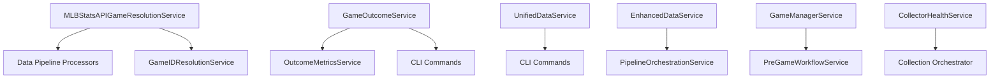

# Services Directory Dependency Analysis

**Analysis Date**: 2025-01-24  
**Scope**: `/src/services` directory and broader codebase references  
**Services Analyzed**: 20 service files across 7 subdirectories

## Executive Summary

The `/src/services` directory contains **19 distinct service classes** with a clear dependency hierarchy. **8 services are actively referenced** by other components, while **11 services appear to be orphaned**. The architecture shows good separation of concerns with no circular dependencies detected.

## Directory Structure

```
src/services/
├── __init__.py                              # Service registry
├── batch_collection_service.py              # 🔴 ORPHANED
├── cross_site_game_resolution_service.py    # 🔴 ORPHANED  
├── cross_source_game_matching_service.py    # 🔴 ORPHANED
├── data_synchronization_service.py          # 🔴 ORPHANED
├── game_id_resolution_service.py            # 🔴 ORPHANED
├── game_outcome_service.py                  # 🟢 HEAVILY USED (6 refs)
├── mlb_schedule_service.py                  # 🔴 ORPHANED
├── mlb_stats_api_game_resolution_service.py # 🟢 HEAVILY USED (4 refs)
├── sharp_action_detection_service.py        # 🟡 LIGHTLY USED (1 ref)
├── data/
│   ├── enhanced_data_service.py             # 🟡 MODERATELY USED (2 refs)
│   └── unified_data_service.py              # 🟡 MODERATELY USED (2 refs)
├── game/
│   └── game_manager_service.py              # 🟡 LIGHTLY USED (1 ref)
├── monitoring/
│   ├── collector_health_service.py          # 🟡 MODERATELY USED (2 refs)
│   ├── outcome_metrics_service.py           # 🟡 LIGHTLY USED (1 ref)
│   └── unified_monitoring_service.py        # 🔴 ORPHANED
├── orchestration/
│   └── pipeline_orchestration_service.py    # 🟡 LIGHTLY USED (1 ref)
├── reporting/
│   └── unified_reporting_service.py         # 🔴 ORPHANED
├── scheduling/
│   └── scheduler_engine_service.py          # 🔴 ORPHANED
├── strategy/
│   └── strategy_manager_service.py          # 🔴 ORPHANED
└── workflow/
    └── pre_game_workflow_service.py         # 🔴 ORPHANED
```

## Referenced Services

### 🟢 Heavily Referenced Services (4+ references)

#### **GameOutcomeService** - 6 references
**Purpose**: MLB game outcome tracking and validation  
**Status**: 🟢 **Production Active**

**Referenced by**:
- `src/interfaces/cli/commands/data.py` (CLI integration)
- `src/interfaces/cli/commands/game_outcomes.py` (primary CLI command)
- `src/services/monitoring/outcome_metrics_service.py` (dependency injection)
- `utilities/test_game_outcomes.py` (testing utilities)
- `utilities/action_network_quickstart.py` (integration example)
- `docs/GAME_OUTCOME_INTEGRATION.md` (documentation)

**Key Features**:
- Game completion verification
- Score validation against MLB Stats API
- Outcome status tracking
- Integration with multiple data sources

#### **MLBStatsAPIGameResolutionService** - 4 references  
**Purpose**: Game ID resolution between external sources and MLB Stats API  
**Status**: 🟢 **Production Active**

**Referenced by**:
- `src/services/game_id_resolution_service.py` (core dependency)
- `src/data/pipeline/staging_action_network_history_processor.py` (data processing)
- `src/data/pipeline/staging_action_network_historical_processor.py` (data processing)
- `src/data/pipeline/staging_action_network_unified_processor.py` (data processing)

**Key Features**:
- Cross-platform game ID mapping
- Team name normalization
- Date-based game matching
- Caching for performance optimization

### 🟡 Moderately Referenced Services (2-3 references)

#### **EnhancedDataService** - 2 references
**Purpose**: Enhanced data collection and management  
**Referenced by**:
- `src/services/orchestration/pipeline_orchestration_service.py`
- `examples/pipeline_usage_examples.py`

#### **UnifiedDataService** - 2 references  
**Purpose**: Unified data access layer  
**Referenced by**:
- `src/interfaces/cli/commands/action_network_history.py`
- `docs/migration/JULY13_10PM_PROGRESS.md`

#### **CollectorHealthService** - 2 references
**Purpose**: Data collector health monitoring  
**Referenced by**:
- `src/interfaces/cli/commands/monitoring.py`
- `src/data/collection/orchestrator.py`

### 🟡 Lightly Referenced Services (1 reference)

| Service | Purpose | Referenced By |
|---------|---------|---------------|
| **GameManagerService** | Game lifecycle management | `src/services/workflow/pre_game_workflow_service.py` |
| **OutcomeMetricsService** | Outcome tracking metrics | `src/interfaces/cli/commands/outcome_metrics.py` |
| **SharpActionDetectionService** | Sharp betting action detection | `src/interfaces/cli/commands/data_quality_improvement.py` |
| **PipelineOrchestrationService** | Data pipeline coordination | `examples/pipeline_usage_examples.py` |

## 🔴 Orphaned Services (11 services)

The following services have **no external references** and may be candidates for removal or integration:

### Core Business Logic (High Impact if Needed)

#### **BatchCollectionService**
**Purpose**: Historical line movement collection in batches  
**Status**: 🔴 **Orphaned**  
**Assessment**: Potentially important for historical data collection. May need integration.

#### **CrossSiteGameResolutionService** 
**Purpose**: Game mapping between different betting sites  
**Status**: 🔴 **Orphaned**  
**Assessment**: Critical for multi-site data correlation. Likely needs integration.

#### **CrossSourceGameMatchingService**
**Purpose**: Automated game matching across data sources  
**Status**: 🔴 **Orphaned**  
**Assessment**: Essential for data integrity. Should be evaluated for integration.

#### **DataSynchronizationService**
**Purpose**: Resolves timing mismatches between data sources  
**Status**: 🔴 **Orphaned**  
**Assessment**: Important for data consistency. May be replaced by newer services.

#### **MLBScheduleService**
**Purpose**: Retrieval and management of MLB schedule data  
**Status**: 🔴 **Orphaned**  
**Assessment**: Foundational service. Likely should be integrated or replaced.

### Automation & Orchestration

#### **SchedulerEngineService**
**Purpose**: Task scheduling and automation framework  
**Status**: 🔴 **Orphaned**  
**Assessment**: Important for production automation. Needs evaluation.

#### **StrategyManagerService** 
**Purpose**: Betting strategy management (commented out)  
**Status**: 🔴 **Orphaned**  
**Assessment**: Core business logic. May be incomplete implementation.

#### **PreGameWorkflowService**
**Purpose**: Pre-game workflow coordination  
**Status**: 🔴 **Orphaned**  
**Assessment**: Workflow automation. Dependencies may be incomplete.

### Infrastructure & Utilities

#### **GameIDResolutionService**
**Purpose**: Missing MLB Stats API game ID resolution  
**Status**: 🔴 **Orphaned**  
**Assessment**: May be superseded by `MLBStatsAPIGameResolutionService`.

#### **UnifiedMonitoringService**
**Purpose**: System monitoring (migration placeholder)  
**Status**: 🔴 **Orphaned**  
**Assessment**: Incomplete migration. Contains only commented imports.

#### **UnifiedReportingService**
**Purpose**: Report generation (migration placeholder)  
**Status**: 🔴 **Orphaned**  
**Assessment**: Incomplete migration. Contains only commented imports.

## Dependency Chains

### Primary Dependency Relationships



### Service Layers

**Layer 1 - Core Services**:
- `MLBStatsAPIGameResolutionService`
- `GameOutcomeService`
- `UnifiedDataService`
- `EnhancedDataService`

**Layer 2 - Business Logic Services**:
- `OutcomeMetricsService`
- `SharpActionDetectionService`
- `CollectorHealthService`
- `GameManagerService`

**Layer 3 - Orchestration Services**:
- `PipelineOrchestrationService`
- `PreGameWorkflowService` (orphaned)

## Integration Patterns

### CLI Integration
Most active services are integrated through CLI commands:
- `GameOutcomeService` → `game_outcomes.py`
- `OutcomeMetricsService` → `outcome_metrics.py`
- `CollectorHealthService` → `monitoring.py`
- `SharpActionDetectionService` → `data_quality_improvement.py`

### Data Pipeline Integration
Key services integrated into data processing:
- `MLBStatsAPIGameResolutionService` → Multiple pipeline processors
- `UnifiedDataService` → Action Network history processing

### Example Usage
Several services have example implementations:
- `EnhancedDataService` → `pipeline_usage_examples.py`
- `PipelineOrchestrationService` → `pipeline_usage_examples.py`

## Circular Dependencies

✅ **No circular dependencies detected**

The dependency graph follows a clear hierarchical pattern:
- Core data services at the foundation
- Business logic services in the middle layer
- Orchestration services at the top level

## Recommendations

### 🔴 **High Priority** - Immediate Action Required

1. **Audit Orphaned Services**
   - Review each of the 11 orphaned services
   - Determine integration requirements or mark for removal
   - Priority: `CrossSiteGameResolutionService`, `MLBScheduleService`, `BatchCollectionService`

2. **Complete Service Migrations**
   - Finish `UnifiedMonitoringService` implementation
   - Complete `UnifiedReportingService` implementation  
   - Remove placeholder services or implement properly

3. **Service Documentation**
   - Document service interfaces and contracts
   - Create service integration guidelines
   - Establish service lifecycle management

### 🟡 **Medium Priority** - Planned Improvements

1. **Dependency Injection**
   - Implement proper dependency injection container
   - Reduce hard-coded service dependencies
   - Enable better testing and service swapping

2. **Service Registry**
   - Create centralized service discovery mechanism
   - Implement service health checks
   - Add service metrics and monitoring

3. **Integration Testing**
   - Test complete dependency chains
   - Validate service interactions
   - Ensure proper error handling across services

### 🟢 **Low Priority** - Future Enhancements

1. **Service Consolidation**
   - Merge overlapping functionality
   - Eliminate redundant services
   - Standardize service patterns

2. **Performance Optimization**
   - Add service-level caching
   - Implement connection pooling
   - Optimize cross-service communication

3. **Observability**
   - Add distributed tracing
   - Implement service metrics
   - Create service dashboards

## Migration Status

### ✅ **Active Services** (8 services)
Services currently integrated and functioning in production:
- Game outcome tracking and validation
- Data collection and processing
- CLI command integration
- Monitoring and health checks

### 🔄 **Legacy Services** (11 services)  
Services that appear to be from previous architecture iterations:
- May contain important business logic
- Require evaluation for integration or removal
- Some may be superseded by newer implementations

### 🚧 **Incomplete Services** (2 services)
Services that are migration placeholders:
- `UnifiedMonitoringService`
- `UnifiedReportingService`
- Contain only commented imports and TODOs

## Conclusion

The services directory shows a **well-structured but partially complete migration** from legacy modules to a unified architecture. The **8 active services** form the core of the current system, while the **11 orphaned services** represent potential technical debt or incomplete feature implementations.

**Key strengths**:
- Clear separation of concerns
- No circular dependencies
- Good CLI integration patterns
- Proper service layering

**Areas for improvement**:
- High number of orphaned services (55%)
- Incomplete service migrations
- Lack of centralized service management
- Missing comprehensive service documentation

**Recommended next steps**:
1. Complete audit of orphaned services
2. Finish incomplete service migrations  
3. Establish service governance practices
4. Implement proper dependency injection

This analysis provides a foundation for service architecture decisions and technical debt management in the MLB betting analytics system.