# MLB Betting Program - System Architecture

## Overview
This diagram illustrates the comprehensive architecture of the MLB betting program, showing how data flows from external sources through collection, processing, analysis, and ultimately to betting recommendations.

## System Architecture Diagram

```mermaid
graph TB
    %% External Data Sources
    subgraph "External Data Sources"
        VSIN[VSIN Sharp Data]
        SBD[SportsBettingDime]
        ActionNet[Action Network]
        MLBStats[MLB Stats API]
        OddsAPI[The Odds API]
        SBR[SportsbookReview]
    end

    %% Data Collection Layer
    subgraph "Data Collection Layer"
        CollectionOrch[Collection Orchestrator]
        VSINCollector[VSIN Collector]
        SBDCollector[SBD Collector]
        ActionCollector[Action Network Collector]
        MLBCollector[MLB Stats Collector]
        OddsCollector[Odds API Collector]
        SBRCollector[SBR Collector]
        
        RateLimiter[Rate Limiter]
        DataValidator[Data Quality Validator]
    end

    %% Database Layer
    subgraph "Database Layer - PostgreSQL"
        subgraph "Raw Data Schema"
            RawHTML[raw_html]
            RawOdds[raw_odds]
            RawGames[raw_games]
        end
        
        subgraph "Core Betting Schema"
            Games[games]
            Odds[odds]
            Teams[teams]
            Sportsbooks[sportsbooks]
        end
        
        subgraph "Analytics Schema"
            BettingAnalysis[betting_analysis]
            SharpSignals[sharp_signals]
            LineMovement[line_movement]
            StrategyResults[strategy_results]
        end
        
        subgraph "Operational Schema"
            SystemLogs[system_logs]
            DataQuality[data_quality]
            Monitoring[monitoring]
        end
    end

    %% Data Processing Layer
    subgraph "Data Processing & Models"
        UnifiedRepo[Unified Repository]
        BaseModels[Base Models]
        GameModels[Game Models]
        OddsModels[Odds Models]
        AnalysisModels[Analysis Models]
    end

    %% Analysis Layer
    subgraph "Analysis Layer"
        StrategyOrch[Strategy Orchestrator]
        
        subgraph "Strategy Processors"
            SharpAction[Sharp Action Processor]
            LineMovement[Line Movement Processor]
            Consensus[Consensus Processor]
            RLMDetector[RLM Detector]
            HybridSharp[Hybrid Sharp Processor]
            LateFlip[Late Flip Processor]
            PublicFade[Public Fade Processor]
            Underdog[Underdog Value Processor]
        end
        
        MovementAnalyzer[Movement Analyzer]
        BacktestEngine[Backtesting Engine]
    end

    %% Business Logic Layer
    subgraph "Business Logic Services"
        PipelineOrch[Pipeline Orchestration Service]
        SharpDetection[Sharp Action Detection Service]
        GameOutcome[Game Outcome Service]
        DataService[Enhanced Data Service]
        MonitoringService[Monitoring Service]
        ReportingService[Reporting Service]
    end

    %% Interface Layer
    subgraph "Interface Layer"
        CLI[Command Line Interface]
        
        subgraph "CLI Commands"
            DataCmds[Data Commands]
            MovementCmds[Movement Commands]
            BacktestCmds[Backtest Commands]
            ActionNetCmds[Action Network Commands]
            OutcomeCmds[Outcome Commands]
            DatabaseCmds[Database Commands]
            QualityCmds[Data Quality Commands]
        end
    end

    %% Configuration & Core
    subgraph "Configuration & Core"
        UnifiedConfig[Unified Configuration]
        Logging[Structured Logging]
        Exceptions[Exception Handling]
        ConnectionPool[Database Connection Pool]
    end

    %% Outputs
    subgraph "Outputs & Alerts"
        BettingRecs[Betting Recommendations]
        Alerts[Real-time Alerts]
        Reports[Performance Reports]
        Metrics[System Metrics]
    end

    %% Data Flow Connections
    %% External Sources to Collectors
    VSIN --> VSINCollector
    SBD --> SBDCollector
    ActionNet --> ActionCollector
    MLBStats --> MLBCollector
    OddsAPI --> OddsCollector
    SBR --> SBRCollector

    %% Collectors to Orchestrator
    VSINCollector --> CollectionOrch
    SBDCollector --> CollectionOrch
    ActionCollector --> CollectionOrch
    MLBCollector --> CollectionOrch
    OddsCollector --> CollectionOrch
    SBRCollector --> CollectionOrch

    %% Rate Limiting and Validation
    CollectionOrch --> RateLimiter
    CollectionOrch --> DataValidator

    %% Data Storage
    CollectionOrch --> RawHTML
    CollectionOrch --> RawOdds
    CollectionOrch --> RawGames
    
    %% Data Processing
    RawHTML --> UnifiedRepo
    RawOdds --> UnifiedRepo
    RawGames --> UnifiedRepo
    
    UnifiedRepo --> Games
    UnifiedRepo --> Odds
    UnifiedRepo --> Teams
    UnifiedRepo --> Sportsbooks

    %% Models
    UnifiedRepo --> BaseModels
    BaseModels --> GameModels
    BaseModels --> OddsModels
    BaseModels --> AnalysisModels

    %% Analysis Flow
    Games --> StrategyOrch
    Odds --> StrategyOrch
    
    StrategyOrch --> SharpAction
    StrategyOrch --> LineMovement
    StrategyOrch --> Consensus
    StrategyOrch --> RLMDetector
    StrategyOrch --> HybridSharp
    StrategyOrch --> LateFlip
    StrategyOrch --> PublicFade
    StrategyOrch --> Underdog

    %% Analysis Results
    SharpAction --> BettingAnalysis
    LineMovement --> SharpSignals
    Consensus --> LineMovement
    RLMDetector --> BettingAnalysis
    HybridSharp --> SharpSignals
    LateFlip --> BettingAnalysis
    PublicFade --> BettingAnalysis
    Underdog --> BettingAnalysis

    %% Backtesting
    StrategyOrch --> BacktestEngine
    BacktestEngine --> StrategyResults

    %% Services Integration
    PipelineOrch --> CollectionOrch
    PipelineOrch --> StrategyOrch
    PipelineOrch --> BacktestEngine
    
    SharpDetection --> StrategyOrch
    GameOutcome --> Games
    DataService --> UnifiedRepo
    MonitoringService --> SystemLogs
    ReportingService --> StrategyResults

    %% CLI Integration
    CLI --> DataCmds
    CLI --> MovementCmds
    CLI --> BacktestCmds
    CLI --> ActionNetCmds
    CLI --> OutcomeCmds
    CLI --> DatabaseCmds
    CLI --> QualityCmds

    %% CLI to Services
    DataCmds --> CollectionOrch
    MovementCmds --> MovementAnalyzer
    BacktestCmds --> BacktestEngine
    ActionNetCmds --> ActionCollector
    OutcomeCmds --> GameOutcome
    DatabaseCmds --> UnifiedRepo
    QualityCmds --> DataValidator

    %% Configuration
    UnifiedConfig --> CollectionOrch
    UnifiedConfig --> StrategyOrch
    UnifiedConfig --> PipelineOrch
    UnifiedConfig --> CLI

    %% Logging and Monitoring
    Logging --> SystemLogs
    Exceptions --> SystemLogs
    ConnectionPool --> Monitoring

    %% Final Outputs
    BettingAnalysis --> BettingRecs
    SharpSignals --> Alerts
    StrategyResults --> Reports
    SystemLogs --> Metrics

    %% Styling
    classDef external fill:#e1f5fe,stroke:#0277bd,stroke-width:2px
    classDef collection fill:#f3e5f5,stroke:#7b1fa2,stroke-width:2px
    classDef database fill:#e8f5e8,stroke:#388e3c,stroke-width:2px
    classDef analysis fill:#fff3e0,stroke:#f57c00,stroke-width:2px
    classDef service fill:#fce4ec,stroke:#c2185b,stroke-width:2px
    classDef interface fill:#e3f2fd,stroke:#1976d2,stroke-width:2px
    classDef output fill:#f1f8e9,stroke:#689f38,stroke-width:2px

    class VSIN,SBD,ActionNet,MLBStats,OddsAPI,SBR external
    class CollectionOrch,VSINCollector,SBDCollector,ActionCollector,MLBCollector,OddsCollector,SBRCollector,RateLimiter,DataValidator collection
    class RawHTML,RawOdds,RawGames,Games,Odds,Teams,Sportsbooks,BettingAnalysis,SharpSignals,LineMovement,StrategyResults,SystemLogs,DataQuality,Monitoring database
    class StrategyOrch,SharpAction,Consensus,RLMDetector,HybridSharp,LateFlip,PublicFade,Underdog,MovementAnalyzer,BacktestEngine analysis
    class PipelineOrch,SharpDetection,GameOutcome,DataService,MonitoringService,ReportingService service
    class CLI,DataCmds,MovementCmds,BacktestCmds,ActionNetCmds,OutcomeCmds,DatabaseCmds,QualityCmds interface
    class BettingRecs,Alerts,Reports,Metrics output
```

## Key Architecture Components

### 1. External Data Sources
- **VSIN**: Professional sharp betting data
- **SportsBettingDime**: Current odds from multiple sportsbooks
- **Action Network**: Public betting percentages and trends
- **MLB Stats API**: Official game data and statistics
- **The Odds API**: Real-time odds from various bookmakers
- **SportsbookReview**: Historical odds and consensus data

### 2. Data Collection Layer
- **Collection Orchestrator**: Manages parallel data collection with rate limiting
- **Individual Collectors**: Source-specific data collection with error handling
- **Rate Limiter**: Prevents API rate limit violations
- **Data Quality Validator**: Ensures data integrity and completeness

### 3. Database Layer (PostgreSQL)
- **Raw Data Schema**: Stores unprocessed data from external sources
- **Core Betting Schema**: Normalized game, odds, and team data
- **Analytics Schema**: Analysis results and betting signals
- **Operational Schema**: System logs and monitoring data

### 4. Data Processing & Models
- **Unified Repository**: Abstraction layer for database operations
- **Base Models**: Common data structures and validation
- **Specialized Models**: Game, odds, and analysis-specific models

### 5. Analysis Layer
- **Strategy Orchestrator**: Coordinates multiple analysis strategies
- **Strategy Processors**: Individual betting strategy implementations
- **Movement Analyzer**: Tracks line movement patterns
- **Backtesting Engine**: Validates strategy performance

### 6. Business Logic Services
- **Pipeline Orchestration**: Manages end-to-end data workflows
- **Sharp Action Detection**: Identifies professional betting patterns
- **Game Outcome Service**: Tracks and validates game results
- **Enhanced Data Service**: Unified data access and manipulation

### 7. Interface Layer
- **Command Line Interface**: Primary user interaction point
- **Modular Commands**: Organized by functionality (data, analysis, backtesting)

### 8. Configuration & Core
- **Unified Configuration**: Centralized settings management
- **Structured Logging**: Comprehensive system monitoring
- **Exception Handling**: Robust error management
- **Database Connection Pool**: Efficient database connections

## Data Flow

1. **Collection**: External sources → Collectors → Raw data storage
2. **Processing**: Raw data → Unified models → Core betting tables
3. **Analysis**: Core data → Strategy processors → Analytics results
4. **Backtesting**: Historical data → Backtesting engine → Performance metrics
5. **Output**: Analysis results → Recommendations, alerts, and reports

## Key Features

- **Unified Architecture**: Single codebase with consistent patterns
- **Parallel Processing**: Concurrent data collection and analysis
- **Quality Monitoring**: Comprehensive data validation and quality scoring
- **Strategy Flexibility**: Pluggable strategy processors for different betting approaches
- **Real-time Processing**: Live data ingestion and analysis
- **Comprehensive Logging**: Full audit trail and system monitoring
- **Scalable Design**: Modular components for easy extension

## Technology Stack

- **Language**: Python 3.11+
- **Database**: PostgreSQL with connection pooling
- **Framework**: Pydantic for data validation
- **CLI**: Click for command-line interface
- **Logging**: Structured JSON logging
- **Testing**: pytest with comprehensive coverage
- **Dependencies**: uv for package management

## Operational Patterns

- **Rate Limiting**: Respects API limits across all data sources
- **Error Handling**: Graceful failure handling with retry logic
- **Data Validation**: Multi-level validation from collection to analysis
- **Monitoring**: Real-time system health and performance tracking
- **Configuration**: Environment-based settings with validation
- **Security**: No hardcoded credentials, secure data handling

This architecture provides a robust foundation for automated MLB betting analysis with comprehensive data collection, sophisticated analysis capabilities, and reliable operational monitoring.