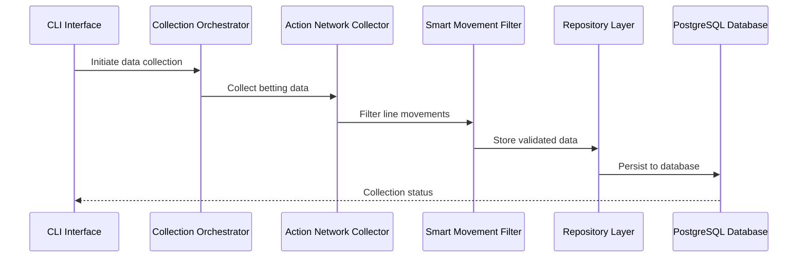
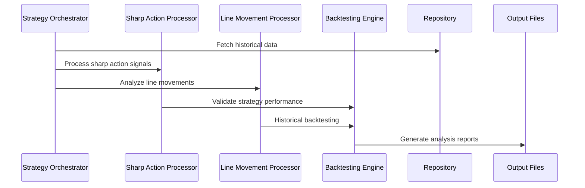

# MLB Betting System - System Architecture Diagram

## Overview

This is a comprehensive 24/7 MLB betting analysis system built with a unified layered architecture. The system collects data from multiple sources, analyzes betting patterns using proven strategies, and provides actionable insights for profitable betting opportunities.

## System Evolution Timeline

Based on git history analysis:
- **July 2025**: Pydantic v2 migration, enhanced Action Network integration, CLI system improvements
- **June 2025**: Database schema consolidation, data quality improvements, comprehensive monitoring
- **Previous phases**: Legacy migration, unified architecture implementation, PostgreSQL transition

## High-Level Architecture

```mermaid
graph TB
    subgraph "External Data Sources"
        AN[Action Network API]
        SBD[SportsBettingDime]
        VSIN[VSIN Data]
        MLB[MLB Stats API]
        OA[Odds API]
    end
    
    subgraph "CLI Interface Layer"
        CLI[Main CLI Entry Point<br/>src/interfaces/cli/main.py]
        DC[Data Commands]
        ANC[Action Network Commands]
        MC[Movement Analysis Commands]
        BC[Backtesting Commands]
        DBC[Database Commands]
        DQC[Data Quality Commands]
        OC[Outcomes Commands]
    end
    
    subgraph "Data Collection Layer"
        ORCH[Collection Orchestrator<br/>src/data/collection/orchestrator.py]
        ANC_COL[Action Network Collector<br/>consolidated_action_network_collector.py]
        SBD_COL[SBD Unified Collector]
        VSIN_COL[VSIN Unified Collector]
        MLB_COL[MLB Stats Collector]
        SMF[Smart Line Movement Filter<br/>smart_line_movement_filter.py]
        RL[Rate Limiter]
        VAL[Data Validators]
    end
    
    subgraph "Core Configuration & Utilities"
        CFG[Central Configuration<br/>src/core/config.py]
        DTU[DateTime Utils<br/>EST/EDT handling]
        TU[Team Utils<br/>MLB team normalization]
        SBU[Sportsbook Utils<br/>ID resolution]
        LOG[Logging System]
    end
    
    subgraph "Data Models (Pydantic v2)"
        GM[Game Models<br/>src/data/models/unified/game.py]
        BAM[Betting Analysis Models<br/>betting_analysis.py]
        MM[Movement Models<br/>movement_analysis.py]
        OM[Odds Models<br/>odds.py]
        SDM[Sharp Data Models<br/>sharp_data.py]
    end
    
    subgraph "Database Layer (PostgreSQL)"
        REPO[Repository Pattern<br/>src/data/database/repositories.py]
        CONN[Database Connection<br/>connection.py]
        SCHEMA[Schema Management]
        MIGR[Migrations<br/>sql/migrations/]
        DQI[Data Quality Improvements<br/>sql/improvements/]
    end
    
    subgraph "Analysis & Strategy Layer"
        SO[Strategy Orchestrator<br/>src/analysis/strategies/orchestrator.py]
        SAP[Sharp Action Processor]
        LMP[Line Movement Processor]
        CP[Consensus Processor]
        LFP[Late Flip Processor]
        HSP[Hybrid Sharp Processor]
        BE[Backtesting Engine<br/>src/analysis/backtesting/engine.py]
    end
    
    subgraph "Services Layer"
        POS[Pipeline Orchestration Service<br/>src/services/orchestration/]
        SADS[Sharp Action Detection Service]
        GOS[Game Outcome Service]
        UDS[Unified Data Service]
        UMS[Unified Monitoring Service]
        URS[Unified Reporting Service]
    end
    
    subgraph "Storage & Output"
        PG[(PostgreSQL Database)]
        LOGS[Application Logs<br/>logs/]
        OUTPUT[Analysis Output<br/>output/, analysis_results/]
        REPORTS[Daily Reports<br/>reports/daily/]
    end
    
    %% Data Flow Connections
    AN --> ANC_COL
    SBD --> SBD_COL
    VSIN --> VSIN_COL
    MLB --> MLB_COL
    
    CLI --> DC
    CLI --> ANC
    CLI --> MC
    CLI --> BC
    CLI --> DBC
    CLI --> DQC
    CLI --> OC
    
    DC --> ORCH
    ORCH --> ANC_COL
    ORCH --> SBD_COL
    ORCH --> VSIN_COL
    ORCH --> MLB_COL
    ORCH --> SMF
    ORCH --> RL
    ORCH --> VAL
    
    ANC_COL --> GM
    SBD_COL --> BAM
    VSIN_COL --> MM
    
    GM --> REPO
    BAM --> REPO
    MM --> REPO
    OM --> REPO
    SDM --> REPO
    
    REPO --> CONN
    CONN --> PG
    
    CFG --> ORCH
    CFG --> REPO
    DTU --> ANC_COL
    TU --> GM
    SBU --> BAM
    
    REPO --> SO
    SO --> SAP
    SO --> LMP
    SO --> CP
    SO --> LFP
    SO --> HSP
    SO --> BE
    
    POS --> ORCH
    POS --> SO
    SADS --> SAP
    GOS --> MLB
    UDS --> REPO
    UMS --> LOGS
    URS --> REPORTS
    
    BE --> OUTPUT
    SO --> OUTPUT
    PG --> REPORTS
    
    %% Styling
    classDef external fill:#e1f5fe
    classDef cli fill:#f3e5f5
    classDef collection fill:#e8f5e8
    classDef core fill:#fff3e0
    classDef models fill:#fce4ec
    classDef database fill:#e0f2f1
    classDef analysis fill:#f1f8e9
    classDef services fill:#e3f2fd
    classDef storage fill:#f9fbe7
    
    class AN,SBD,VSIN,MLB,OA external
    class CLI,DC,ANC,MC,BC,DBC,DQC,OC cli
    class ORCH,ANC_COL,SBD_COL,VSIN_COL,MLB_COL,SMF,RL,VAL collection
    class CFG,DTU,TU,SBU,LOG core
    class GM,BAM,MM,OM,SDM models
    class REPO,CONN,SCHEMA,MIGR,DQI database
    class SO,SAP,LMP,CP,LFP,HSP,BE analysis
    class POS,SADS,GOS,UDS,UMS,URS services
    class PG,LOGS,OUTPUT,REPORTS storage
```



## Detailed Component Architecture

### 1. CLI Interface Layer (`src/interfaces/cli/`)

**Entry Point**: `src/interfaces/cli/main.py`
- Unified command-based interface for all operations
- Modular command structure with specialized command groups
- Real-time monitoring and status reporting capabilities
- Database connection initialization and health checks

**Command Groups**:
- **Data Commands** (`data.py`): Multi-source data collection with testing modes
- **Action Network Commands** (`action_network_pipeline.py`): Specialized Action Network operations
- **Movement Analysis** (`movement_analysis.py`): Line movement and pattern analysis
- **Backtesting** (`backtesting.py`): Strategy validation and historical testing
- **Database Management** (`setup_database.py`): Schema management and migrations
- **Data Quality** (`data_quality_improvement.py`): Quality monitoring and improvements
- **Game Outcomes** (`game_outcomes.py`): MLB game result tracking

### 2. Data Collection Layer (`src/data/collection/`)

**Collection Orchestrator** (`orchestrator.py`):
- Coordinates all data collectors with parallel execution
- Dependency management and scheduling
- Error handling and recovery strategies
- Performance metrics and health monitoring

**Key Collectors**:
- **Action Network Collector** (`consolidated_action_network_collector.py`): Primary betting data source with 8+ major sportsbooks
- **SBD Unified Collector**: SportsBettingDime integration
- **VSIN Unified Collector**: VSIN data collection
- **MLB Stats Collector**: Official MLB statistics and game information

**Data Processing**:
- **Smart Line Movement Filter** (`smart_line_movement_filter.py`): Intelligent noise reduction
- **Rate Limiter**: API rate limiting and throttling
- **Data Validators**: Real-time data quality validation

### 3. Core Configuration & Utilities (`src/core/`)

**Central Configuration** (`config.py`):
- Pydantic v2 settings management
- Environment-based configuration
- Database connection settings
- API credentials and rate limits

**Specialized Utilities**:
- **DateTime Utils** (`datetime_utils.py`): EST/EDT timezone handling
- **Team Utils** (`team_utils.py`): MLB team name normalization and mapping
- **Sportsbook Utils** (`sportsbook_utils.py`): Sportsbook ID resolution and mapping
- **Logging System**: Structured application logging

### 4. Data Models (`src/data/models/unified/`)

**Pydantic v2 Models** - All upgraded to modern validation:
- **Game Models** (`game.py`): Core game information and metadata
- **Betting Analysis Models** (`betting_analysis.py`): Sharp action and pattern analysis
- **Movement Models** (`movement_analysis.py`): Line movement tracking and analysis
- **Odds Models** (`odds.py`): Odds representation and validation
- **Sharp Data Models** (`sharp_data.py`): Professional betting indicators

### 5. Database Layer (`src/data/database/`)

**PostgreSQL Integration**:
- **Repository Pattern** (`repositories.py`): Data access abstraction
- **Connection Management** (`connection.py`): Database connection pooling
- **Schema Management**: Structured database schemas with proper relationships
- **Migrations** (`sql/migrations/`): Version-controlled schema evolution
- **Data Quality Improvements** (`sql/improvements/`): Enhanced data integrity

### 6. Analysis & Strategy Layer (`src/analysis/`)

**Strategy Orchestrator** (`strategies/orchestrator.py`):
- Coordinates multiple betting strategy processors
- Historical performance validation
- Strategy configuration and parameter management

**Strategy Processors** (`processors/`):
- **Sharp Action Processor**: Professional betting pattern detection
- **Line Movement Processor**: Betting line change analysis
- **Consensus Processor**: Public vs. sharp money tracking
- **Late Flip Processor**: Last-minute sharp action identification
- **Hybrid Sharp Processor**: Combined indicator analysis

**Backtesting Engine** (`backtesting/engine.py`):
- Historical strategy validation
- Performance metrics calculation
- Risk-adjusted returns analysis

### 7. Services Layer (`src/services/`)

**Orchestration Services** (`orchestration/`):
- **Pipeline Orchestration Service**: End-to-end workflow management
- Complex multi-stage pipeline coordination
- State management and recovery

**Specialized Services**:
- **Sharp Action Detection Service**: Automated professional betting detection
- **Game Outcome Service**: MLB game result tracking and validation
- **Unified Data Service**: Centralized data access coordination
- **Unified Monitoring Service**: System health and performance monitoring
- **Unified Reporting Service**: Automated report generation

### 8. Storage & Output

**PostgreSQL Database**:
- Normalized schema with proper foreign key relationships
- Comprehensive indexing for performance
- Data quality constraints and validation
- Historical data preservation

**File-based Storage**:
- **Application Logs** (`logs/`): Structured application logging
- **Analysis Output** (`output/`, `analysis_results/`): Strategy results and analysis
- **Daily Reports** (`reports/daily/`): Automated daily performance reports

## Data Flow Architecture

### Primary Data Collection Flow



### Strategy Analysis Flow



## Technology Stack

### Core Technologies
- **Python 3.10+**: Primary development language
- **PostgreSQL**: Primary database with full ACID compliance
- **Pydantic v2**: Data validation and settings management
- **Click**: CLI interface framework
- **Rich**: Enhanced terminal UI and progress display
- **AsyncIO**: Asynchronous programming for data collection

### Development Tools
- **UV**: Fast Python package management
- **Ruff**: Code formatting and linting
- **MyPy**: Static type checking
- **PyTest**: Testing framework with coverage reporting

### Data Sources Integration
- **Action Network API**: Primary betting data with 8+ sportsbooks
- **SportsBettingDime**: Additional betting splits and consensus data
- **VSIN**: Professional betting insights
- **MLB Stats API**: Official game information and statistics
- **Odds API**: Additional odds comparison data

## Deployment Architecture

### Development Workflow
```bash
# Primary development commands
uv sync                                                    # Install dependencies
uv run -m src.interfaces.cli data collect --source action_network --real  # Live data collection
uv run -m src.interfaces.cli data status --detailed       # System status
uv run pytest --cov=src                                   # Testing with coverage
uv run ruff format && uv run ruff check && uv run mypy src/  # Code quality
```

### Production Characteristics
- **24/7 Operation**: Continuous data collection during MLB season
- **Rate Limiting**: Respectful API usage with intelligent throttling
- **Error Recovery**: Automatic retry mechanisms and graceful degradation
- **Data Quality**: Real-time validation and quality monitoring
- **Performance Monitoring**: Comprehensive system health tracking

## Key Architectural Patterns

### 1. Repository Pattern
- Clean separation between business logic and data access
- Testable and maintainable database operations
- Support for multiple data sources

### 2. Strategy Pattern
- Pluggable betting strategy processors
- Consistent interface for different analysis approaches
- Easy addition of new strategies

### 3. Observer Pattern
- Real-time monitoring and health checking
- Event-driven architecture for data updates
- Loose coupling between components

### 4. Command Pattern
- CLI interface with modular command structure
- Consistent operation patterns across different domains
- Easy extension and testing

## Integration Points

### External API Integration
- Rate-limited HTTP clients for all external APIs
- Automatic retry with exponential backoff
- Circuit breaker pattern for API failures
- Response caching and deduplication

### Database Integration
- Connection pooling for performance
- Transaction management for data consistency
- Migration system for schema evolution
- Backup and recovery procedures

### Monitoring Integration
- Structured logging with correlation IDs
- Performance metrics collection
- Health check endpoints
- Alert generation for critical issues

## Security Considerations

### Data Protection
- API keys and secrets managed through environment variables
- Database credentials secured and rotated
- No sensitive data in logs or outputs
- Input validation and sanitization

### Access Control
- Database-level permissions and constraints
- API rate limiting to prevent abuse
- Audit logging for data access
- Secure configuration management

## Scalability Considerations

### Horizontal Scaling
- Stateless service design for easy scaling
- Database connection pooling
- Asynchronous processing for I/O operations
- Modular architecture for service separation

### Performance Optimization
- Smart caching strategies for repeated data access
- Batch processing for bulk operations
- Index optimization for database queries
- Memory-efficient data processing

## Onboarding Guide

### For Architects
1. Review this system architecture diagram
2. Examine `src/core/config.py` for configuration management
3. Study `src/data/collection/orchestrator.py` for data flow coordination
4. Analyze `src/services/orchestration/pipeline_orchestration_service.py` for business logic

### For Engineers
1. Set up development environment with `uv sync`
2. Run tests with `uv run pytest` to verify setup
3. Explore CLI commands with `uv run -m src.interfaces.cli --help`
4. Start with data collection: `uv run -m src.interfaces.cli data test --source action_network --real`

### For Analysts
1. Review analysis output in `output/` and `analysis_results/` directories
2. Examine strategy processors in `src/analysis/processors/`
3. Run backtesting: `uv run -m src.interfaces.cli backtest run --start-date 2024-06-01 --end-date 2024-06-30`
4. Generate reports: `uv run -m src.interfaces.cli data status --detailed`

---

*Generated: July 21, 2025*
*System Version: Post-Pydantic v2 Migration with Enhanced Action Network Integration*