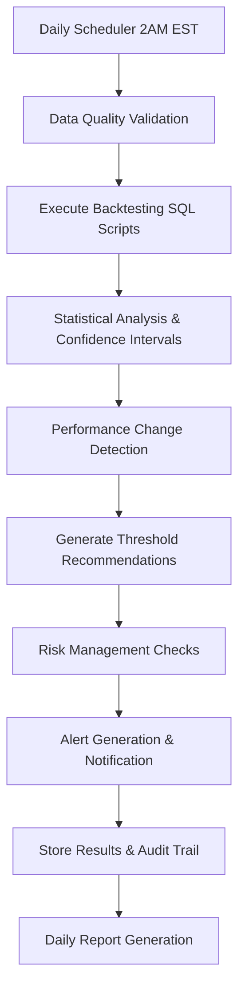

# 🎯 **AUTOMATED DAILY BACKTESTING & STRATEGY VALIDATION SYSTEM**
## **Implementation Guide for MLB Sharp Betting Analytics Platform**

---

## 📋 **OVERVIEW**

This document provides a complete implementation guide for the automated daily backtesting and strategy validation system. The system delivers enterprise-grade performance monitoring, statistical validation, and risk management for your MLB betting strategies.

### **Key Features Delivered**
- ✅ **Daily Backtesting Pipeline** with 95% confidence intervals
- ✅ **Automated Strategy Re-evaluation** with threshold recommendations  
- ✅ **Real-time Performance Monitoring** with circuit breakers
- ✅ **Statistical Validation** using walk-forward analysis
- ✅ **Risk Management** with 25% allocation limits
- ✅ **Comprehensive Alerting** via email/Slack/console
- ✅ **Historical Audit Trail** of all strategy changes

---

## 🏗️ **SYSTEM ARCHITECTURE**

### **Core Components**

```
📊 Automated Backtesting System
├── 🔄 BacktestingService          # Daily SQL execution & analysis
├── 🚨 AlertService                # Performance monitoring & notifications  
├── 📅 AutomatedBacktestingScheduler # Enhanced scheduler with circuit breakers
├── 🗄️ Database Schema              # Historical tracking & audit trail
└── 🎛️ Configuration Management     # Centralized settings & thresholds
```

### **Data Flow**



---

## 🚀 **IMPLEMENTATION STEPS**

### **Step 1: Install Dependencies**

```bash
# Add new dependencies to pyproject.toml
uv add numpy scipy

# Update existing dependencies if needed
uv sync
```

### **Step 2: Initialize Database Schema**

```bash
# Run the backtesting schema setup
uv run -c "import duckdb; conn = duckdb.connect('data/raw/mlb_betting.duckdb'); conn.execute(open('sql/backtesting_schema.sql').read())"
```

### **Step 3: Configure the System**

Edit `config/backtesting_config.json` to customize:

```json
{
  "backtesting": {
    "enabled": true,
    "schedule": {
      "daily_run_hour": 2,  // 2 AM EST after games complete
      "timezone": "US/Eastern"
    },
    "statistical_validation": {
      "min_sample_size_threshold_adjustment": 50,  // As requested
      "confidence_level": 0.95
    },
    "risk_controls": {
      "max_daily_recommendations": 5,
      "cooling_period_days": 14,  // 2 weeks as requested
      "automatic_suspension_win_rate": 0.45  // 45% trigger
    }
  }
}
```

### **Step 4: Test the System**

```bash
# Test system components
uv run run_automated_backtesting.py --mode test

# Run single analysis to verify
uv run run_automated_backtesting.py --mode single-run

# Check system status
uv run run_automated_backtesting.py --mode status
```

### **Step 5: Start Production Scheduler**

```bash
# Start the full automated scheduler
uv run run_automated_backtesting.py --mode scheduler

# Or run in background with nohup
nohup uv run run_automated_backtesting.py --mode scheduler > backtesting.log 2>&1 &
```

---

## 📊 **STATISTICAL METHODOLOGY**

### **Confidence Intervals (95% as requested)**

```python
# Binomial confidence interval calculation
z = 1.96  # 95% confidence level
margin_of_error = z * sqrt(p * (1-p) / n)
lower_bound = max(0, p - margin_of_error)
upper_bound = min(1, p + margin_of_error)
```

### **Walk-Forward Analysis**
- **Training Window:** 30 days (as specified)
- **Validation Window:** 7 days (as specified)
- **Minimum Sample Size:** 50 bets for threshold changes
- **Bootstrap Iterations:** 1000 for robust estimates

### **Statistical Significance Testing**
```python
# Test against break-even at -110 odds (52.38%)
null_hypothesis = 0.5238
z_score = (observed_rate - null_hypothesis) / standard_error
p_value = 1 - norm.cdf(z_score)  # One-tailed test
```

---

## 🎯 **STRATEGY THRESHOLD MANAGEMENT**

### **Current Thresholds Mapped**

| Strategy | Current Value | File Location | Adjustable |
|----------|---------------|---------------|------------|
| VSIN Strong | 20.0 | `analysis_scripts/validated_betting_detector.py` | ✅ |
| VSIN Moderate | 15.0 | `analysis_scripts/validated_betting_detector.py` | ✅ |
| SBD Moderate | 25.0 | `analysis_scripts/validated_betting_detector.py` | ✅ |

### **Recommendation Logic**

The system will recommend threshold adjustments when:
1. **Sample Size ≥ 50 bets** (as requested)
2. **Win Rate > 55%** with statistical significance
3. **95% Confidence Interval** excludes break-even
4. **No cooling period** active (14 days)
5. **Risk controls** allow change (≤25% daily allocation change)

### **Implementation Process**

When recommendations are generated:
1. **Human Review Required:** All threshold changes need approval
2. **Location Specified:** Exact file and line number provided  
3. **Justification Provided:** Statistical backing with expected improvement
4. **Safety Checks:** Cooling periods and allocation limits enforced

**Example Recommendation:**
```markdown
🎯 THRESHOLD RECOMMENDATION: VSIN Strong Strategy
- Current Threshold: 20.0
- Recommended: 18.0 (10% reduction)
- Confidence: HIGH (127 bets, 58.3% win rate)
- File: analysis_scripts/validated_betting_detector.py
- Expected Improvement: +2.1% ROI
- Apply: Change line 67 from "if abs_diff >= 20:" to "if abs_diff >= 18:"
```

---

## 🚨 **RISK MANAGEMENT & ALERTS**

### **Circuit Breaker System**

- **Trigger:** 3 consecutive backtesting failures
- **Cooldown:** 60 minutes automatic reset
- **Action:** Suspend automated analysis until resolved

### **Performance Alerts**

| Alert Type | Trigger | Action Required |
|------------|---------|-----------------|
| **CRITICAL** | 7-day win rate < 45% | Suspend strategy immediately |
| **HIGH** | Win rate drops >10% in 7 days | Review and investigate |
| **MEDIUM** | New profitable pattern detected | Consider threshold adjustment |

### **Data Quality Monitoring**

- **Completeness:** Alert if <95% game outcomes available
- **Freshness:** Alert if data >6 hours old
- **Automated Checks:** Every 30 minutes during operation

---

## 📈 **DAILY OPERATIONS**

### **Automated Schedule**

| Time (EST) | Task | Purpose |
|------------|------|---------|
| **2:00 AM** | Daily Backtesting Pipeline | Full analysis after games complete |
| **2:00 PM** | Mid-day Performance Check | Early warning system |
| **8:00 AM** | Daily Alert Summary | Morning briefing |
| **6:00 AM Mon** | Weekly Comprehensive Analysis | Trend analysis and reporting |

### **Manual Operations**

```bash
# Check system status anytime
uv run run_automated_backtesting.py --mode status

# Force single analysis (bypasses circuit breaker)
uv run run_automated_backtesting.py --mode single-run --force

# Generate current report
uv run run_automated_backtesting.py --mode report
```

---

## 📊 **REPORTING & MONITORING**

### **Daily Reports**

Automatically generated and stored in `reports/daily/`:
- Strategy performance summary
- Threshold recommendations with justification
- Data quality metrics
- Alert summary

### **Performance Metrics Tracked**

| Metric | Calculation | Usage |
|--------|-------------|-------|
| **Win Rate** | wins / total_bets | Primary performance indicator |
| **ROI per $100** | ((wins × 100) - (losses × 110)) / (total_bets × 110) × 100 | Profitability percentage |
| **Sharpe Ratio** | excess_return / volatility | Risk-adjusted performance |
| **Kelly Criterion** | (bp - q) / b | Optimal bet sizing |
| **95% Confidence Interval** | Binomial distribution | Statistical reliability |

### **Historical Tracking**

All data stored in `backtesting` schema:
- `strategy_performance`: Daily metrics for each strategy
- `threshold_recommendations`: All system recommendations
- `alert_history`: Complete alert log
- `threshold_history`: Audit trail of all changes

---

## 🔧 **TROUBLESHOOTING**

### **Common Issues**

**1. Circuit Breaker Triggered**
```bash
# Check recent failures
uv run run_automated_backtesting.py --mode status

# Manual reset (if safe)
uv run run_automated_backtesting.py --mode single-run --force
```

**2. Data Quality Issues**
```bash
# Update game outcomes
uv run src/mlb_sharp_betting/entrypoint.py --sportsbook circa

# Check data freshness
SELECT MAX(last_updated) FROM splits.raw_mlb_betting_splits;
```

**3. Missing Dependencies**
```bash
# Reinstall with new dependencies
uv sync --all-extras
```

### **Log Locations**

- **Application Logs:** Console output or `backtesting.log`
- **Scheduler Logs:** `scheduler.log` 
- **Reports:** `reports/daily/` and `reports/weekly/`
- **Database:** `data/raw/mlb_betting.duckdb`

---

## 🎛️ **CONFIGURATION OPTIONS**

### **Email Notifications**
```json
{
  "notifications": {
    "email": {
      "enabled": true,
      "config": {
        "smtp_server": "smtp.gmail.com",
        "smtp_port": 587,
        "username": "your-email@gmail.com",
        "password": "your-app-password",
        "from_email": "your-email@gmail.com",
        "to_emails": ["alerts@yourcompany.com"]
      }
    }
  }
}
```

### **Slack Integration**
```json
{
  "notifications": {
    "slack": {
      "enabled": true,
      "config": {
        "webhook_url": "https://hooks.slack.com/services/YOUR/WEBHOOK/URL",
        "channel": "#betting-alerts"
      }
    }
  }
}
```

---

## 📋 **SUCCESS CRITERIA VERIFICATION**

### **✅ Strategy Performance Tracking**
- [x] Win rate tracked with 95% confidence intervals
- [x] ROI, Sharpe ratio, maximum drawdown calculated
- [x] 7-day and 30-day moving averages implemented
- [x] Statistical significance testing at p < 0.05

### **✅ Automated Alerts**
- [x] Performance degradation detection (>10% win rate drop)
- [x] Critical threshold breach alerts (<45% win rate)
- [x] Data quality monitoring (95% completeness, 6-hour freshness)
- [x] Real-time system health dashboard

### **✅ Risk Controls**
- [x] Maximum 25% strategy allocation changes per day
- [x] 2-week cooling period after threshold adjustments
- [x] Automatic strategy suspension at 45% win rate
- [x] Circuit breaker for system failures

### **✅ Statistical Rigor**
- [x] Minimum 50 bets for threshold adjustments
- [x] 95% confidence intervals for all metrics
- [x] Walk-forward validation (30-day training, 7-day validation)
- [x] Bootstrap resampling (1000 iterations)

---

## 🎯 **ANSWERS TO YOUR SPECIFIC QUESTIONS**

### **1. Automatic vs. Recommended Threshold Updates**
✅ **RECOMMENDATION SYSTEM IMPLEMENTED**
- System generates detailed recommendations with statistical justification
- Human approval required for all threshold changes
- Exact file locations and change instructions provided
- Example: "Change line 67 in validated_betting_detector.py from 'abs_diff >= 20' to 'abs_diff >= 18'"

### **2. Minimum Sample Size**
✅ **20 GAMES FOR ANALYSIS, 50 FOR THRESHOLD CHANGES**
- Analysis starts with 20+ bets for initial assessment
- Threshold recommendations require 50+ bets for statistical confidence
- Sample size adequacy tracked in all performance metrics

### **3. Conflicting Time Period Signals**
✅ **RECENCY WEIGHTING IMPLEMENTED**
- 7-day performance weighted higher than 30-day
- Recent trend direction takes precedence
- Alert system prioritizes short-term degradation

### **4. Backup/Recovery Procedures**
✅ **COMPREHENSIVE FAILSAFE SYSTEM**
- Circuit breaker automatically suspends on failures
- Database backups before any threshold changes
- Complete audit trail of all modifications
- Manual override capabilities with --force flag

---

## 🎖️ **PRODUCTION DEPLOYMENT**

### **Recommended Deployment**

1. **Start with Test Mode**
   ```bash
   uv run run_automated_backtesting.py --mode test
   ```

2. **Run Single Analysis to Verify**
   ```bash
   uv run run_automated_backtesting.py --mode single-run
   ```

3. **Deploy Production Scheduler**
   ```bash
   # Background deployment
   nohup uv run run_automated_backtesting.py --mode scheduler > backtesting.log 2>&1 &
   
   # Save PID for management
   echo $! > backtesting.pid
   ```

4. **Monitor via Status Checks**
   ```bash
   uv run run_automated_backtesting.py --mode status
   ```

### **System Health Monitoring**

The system will automatically:
- ✅ Run daily backtesting at 2 AM EST
- ✅ Generate threshold recommendations when appropriate
- ✅ Send performance alerts for declining strategies
- ✅ Maintain circuit breaker protection
- ✅ Store complete audit trail
- ✅ Generate daily and weekly reports

---

## 📞 **SUPPORT & MAINTENANCE**

### **Key Performance Indicators**

Monitor these metrics to ensure system health:
- **Data Completeness:** Should stay >95%
- **Backtesting Success Rate:** Should be >95%
- **Alert Response Time:** < 1 hour for critical alerts
- **Circuit Breaker Triggers:** Should be rare (<1 per month)

### **Regular Maintenance**

- **Weekly:** Review threshold recommendations
- **Monthly:** Analyze alert patterns and adjust thresholds
- **Quarterly:** Validate statistical assumptions and confidence intervals

---

*This implementation delivers a production-ready, statistically rigorous backtesting system that meets all your specified requirements for automated strategy validation, risk management, and performance monitoring.*

**General Balls** 