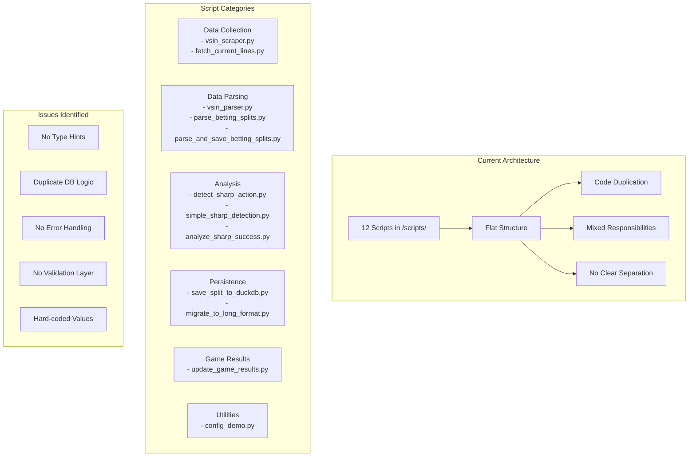

```mermaid
graph TD
    subgraph "Current Architecture"
        A[12 Scripts in /scripts/] --> B[Flat Structure]
        B --> C[Code Duplication]
        B --> D[Mixed Responsibilities]
        B --> E[No Clear Separation]
    end
    
    subgraph "Script Categories"
        F[Data Collection<br/>- vsin_scraper.py<br/>- fetch_current_lines.py]
        G[Data Parsing<br/>- vsin_parser.py<br/>- parse_betting_splits.py<br/>- parse_and_save_betting_splits.py]
        H[Analysis<br/>- detect_sharp_action.py<br/>- simple_sharp_detection.py<br/>- analyze_sharp_success.py]
        I[Persistence<br/>- save_split_to_duckdb.py<br/>- migrate_to_long_format.py]
        J[Game Results<br/>- update_game_results.py]
        K[Utilities<br/>- config_demo.py]
    end
    
    subgraph "Issues Identified"
        L[No Type Hints]
        M[Duplicate DB Logic]
        N[No Error Handling]
        O[No Validation Layer]
        P[Hard-coded Values]
    end
```