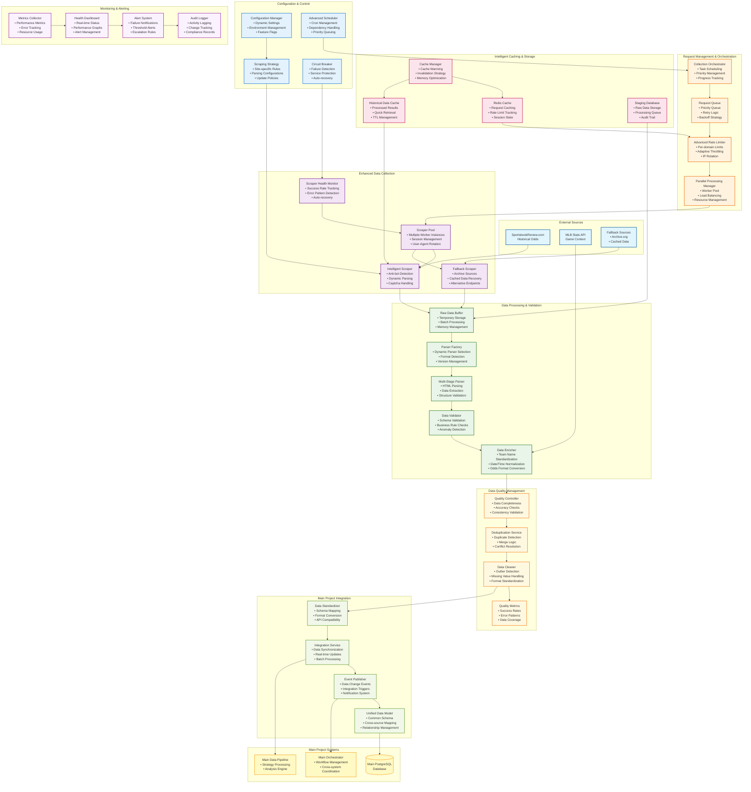

# Enhanced Sportsbook Review System Architecture

## System Overview

## Key Architecture Improvements

### 1. **Robust Request Management**
- **Request Queue**: Priority-based processing with intelligent retry logic
- **Advanced Rate Limiter**: Per-domain limits with adaptive throttling
- **Parallel Processing**: Worker pool for concurrent scraping operations
- **Circuit Breaker**: Automatic failure detection and recovery

### 2. **Intelligent Data Collection**
- **Scraper Pool**: Multiple worker instances with session management
- **Anti-bot Protection**: User-agent rotation, captcha handling, dynamic parsing
- **Fallback Mechanisms**: Archive sources and cached data recovery
- **Health Monitoring**: Real-time success rate tracking and auto-recovery

### 3. **Multi-Stage Data Processing**
- **Parser Factory**: Dynamic parser selection based on content structure
- **Data Validator**: Schema validation and business rule checks
- **Data Enricher**: Team name standardization and odds format conversion
- **Quality Controller**: Comprehensive data quality management

### 4. **Advanced Caching Strategy**
- **Redis Cache**: Request caching and rate limit tracking
- **Historical Cache**: Processed results for quick retrieval
- **Staging Database**: Raw data storage with audit trails
- **Cache Manager**: Intelligent cache warming and invalidation

### 5. **Seamless Integration**
- **Data Standardizer**: Schema mapping for main project compatibility
- **Integration Service**: Real-time synchronization and batch processing
- **Event Publisher**: Data change notifications and integration triggers
- **Unified Data Model**: Common schema across all data sources

## Technology Recommendations

### Core Technologies
- **Queue System**: Redis + Celery for distributed task processing
- **Cache Layer**: Redis Cluster for high-availability caching
- **Database**: PostgreSQL for staging, with connection pooling
- **Monitoring**: Prometheus + Grafana for metrics and alerting

### Integration Patterns
- **Event-Driven**: Kafka or Redis Pub/Sub for real-time updates
- **API Gateway**: For standardized data access across systems
- **Data Contracts**: JSON Schema for consistent data formats
- **Circuit Breaker**: Hystrix or similar for resilience

### Deployment Considerations
- **Containerization**: Docker for consistent deployment
- **Orchestration**: Kubernetes or Docker Swarm for scaling
- **Load Balancing**: HAProxy or Nginx for request distribution
- **Monitoring**: ELK Stack for centralized logging

## Integration Points with Main Project

### Data Flow Integration
1. **Historical Data Enrichment**: SBR data feeds into main project's historical analysis
2. **Real-time Updates**: Event-driven updates to main project pipelines
3. **Unified Schema**: Common data models across all systems
4. **Quality Metrics**: Shared data quality monitoring and alerting

### Configuration Synchronization
- Shared configuration service for consistent settings
- Feature flags for coordinated rollouts
- Unified monitoring dashboards
- Cross-system health checks

This enhanced architecture provides the robustness, scalability, and integration capabilities needed for a production sports betting data system while maintaining clear separation of concerns and easy maintenance.