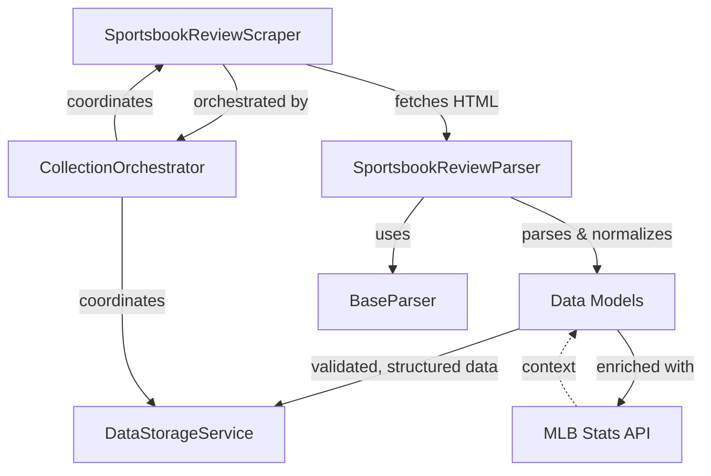

```mermaid
flowchart TD
    A[SportsbookReviewScraper] -->|fetches HTML| B[SportsbookReviewParser]
    B -->|parses & normalizes| C[Data Models]
    C -->|validated, structured data| D[DataStorageService]
    A -->|orchestrated by| E[CollectionOrchestrator]
    E -->|coordinates| A
    E -->|coordinates| D
    B -->|uses| F[BaseParser]
    C -->|enriched with| G[MLB Stats API]
    G -.->|context| C
```